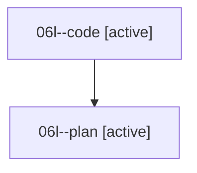

# Family: 06l

[Agent Hoods](../README.md) / [bbugyi200](../users/bbugyi200/README.md) / [athena](../users/bbugyi200/machines/athena/README.md) / [06l](../users/bbugyi200/machines/athena/hoods/06l/README.md) / 06l

Owner: `bbugyi200.athena` · Hood: `06l` · Members: 2

## Lineage

The diagram is an optional enhancement; the ordered table below contains the same lineage in accessible text.

| Role | Agent | State | Model / provider | Timing | Commits | Prompt | Chat |
|---|---|---|---|---|---:|---|---|
| code | 06l--code | active | grok-4.6 / grok | 2026-08-18T18:04:31.503815+00:00 | 0 | — | — |
| plan | 06l--plan | active | opus / claude | 2026-08-18T17:56:54.363391+00:00 | 0 | [Prompt](../agents/bbugyi200.athena.06l--plan/prompt.md) | [Chat](../agents/bbugyi200.athena.06l--plan/chat.md) |

## Commits

| Role | Repo | Commit | Subject | Committed |
|---|---|---|---|---|
| — | sase | [`704a340`](https://github.com/sase-org/sase/commit/704a3400556a772f9707154e454f1a257125d77b) | chore: Add SDD prompt and plan for dismissed\_archive\_paging | 2026-06-25 18:49:33 EDT |
| — | sase | [`d4bef54`](https://github.com/sase-org/sase/commit/d4bef5479d810854bae333fe642012aea3a2fe41) | perf(ace): page dismissed archive revive loads | 2026-06-25 19:04:03 EDT |
