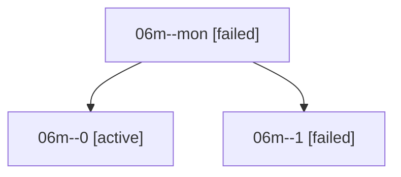

# Family: 06m

[Agent Hoods](../README.md) / [bbugyi200](../users/bbugyi200/README.md) / [athena](../users/bbugyi200/machines/athena/README.md) / [06m](../users/bbugyi200/machines/athena/hoods/06m/README.md) / 06m

Owner: `bbugyi200.athena` · Hood: `06m` · Members: 3

## Lineage

The diagram is an optional enhancement; the ordered table below contains the same lineage in accessible text.

| Role | Agent | State | Model / provider | Timing | Commits | Prompt | Chat |
|---|---|---|---|---|---:|---|---|
| mon | 06m--mon | failed | sonnet / claude | 2026-09-07T23:17:06.206738+00:00 → 2026-09-07T23:44:20.610816+00:00 | 0 | — | [Chat](../agents/bbugyi200.athena.06m--mon/chat.md) |
| 0 | 06m--0 | active | sonnet / claude | 2026-09-07T22:29:31.663491+00:00 | 0 | [Prompt](../agents/bbugyi200.athena.06m--0/prompt.md) | [Chat](../agents/bbugyi200.athena.06m--0/chat.md) |
| 1 | 06m--1 | failed | opus / claude | 2026-09-07T23:44:52.435933+00:00 → 2026-09-07T23:52:41.653380+00:00 | 0 | [Prompt](../agents/bbugyi200.athena.06m--1/prompt.md) | — |

## Commits

| Role | Repo | Commit | Subject | Committed |
|---|---|---|---|---|
| — | sase | [`e759de9`](https://github.com/sase-org/sase/commit/e759de930ddc95774592d675e62398993f15f2ae) | chore: Add SDD prompt and plan for wait\_plan\_agents\_1 | 2026-06-25 18:49:38 EDT |
| — | sase | [`53428f1`](https://github.com/sase-org/sase/commit/53428f1e76fb0e33f197d0851a4142da25893859) | feat(wait): support %wait on submitted plan agents | 2026-06-25 19:14:36 EDT |
