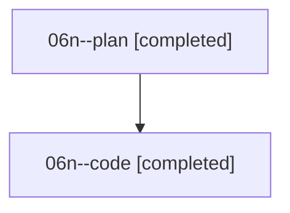

# Family: 06n

[Agent Hoods](../README.md) / [bbugyi200](../users/bbugyi200/README.md) / [athena](../users/bbugyi200/machines/athena/README.md) / [06n](../users/bbugyi200/machines/athena/hoods/06n/README.md) / 06n

Owner: `bbugyi200.athena` · Hood: `06n` · Members: 2

## Lineage

The diagram is an optional enhancement; the ordered table below contains the same lineage in accessible text.

| Role | Agent | State | Model / provider | Timing | Commits | Prompt | Chat |
|---|---|---|---|---|---:|---|---|
| plan | 06n--plan | completed | opus / claude | 2026-08-18T19:05:45.557733+00:00 | 0 | [Prompt](../agents/bbugyi200.athena.06n--plan/prompt.md) | [Chat](../agents/bbugyi200.athena.06n--plan/chat.md) |
| code | 06n--code | completed | grok-4.6 / grok | 2026-08-18T19:17:47.445527+00:00 | [1](../agents/bbugyi200.athena.06n--code/README.md#commits) | — | [Chat](../agents/bbugyi200.athena.06n--code/chat.md) |

## Commits

| Role | Repo | Commit | Subject | Committed |
|---|---|---|---|---|
| — | sase | [`c772feb`](https://github.com/sase-org/sase/commit/c772feb216286526e1a1d3a4f92e3648e105cb7f) | feat(tui): add command palette position indicator | 2026-06-25 19:08:02 EDT |
| code | sase | [`610c19c`](https://github.com/sase-org/sase/commit/610c19cd8b772dff6fe566a206c9a2459dfd5b51) | feat(ace): show model-usage strip in Alias History | 2026-08-18 16:02:16 EDT |
