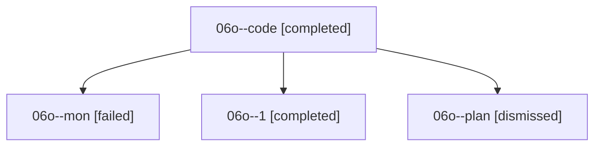

# Family: 06o

[Agent Hoods](../README.md) / [bbugyi200](../users/bbugyi200/README.md) / [athena](../users/bbugyi200/machines/athena/README.md) / [06o](../users/bbugyi200/machines/athena/hoods/06o/README.md) / 06o

Owner: `bbugyi200.athena` · Hood: `06o` · Members: 4

## Lineage

The diagram is an optional enhancement; the ordered table below contains the same lineage in accessible text.

| Role | Agent | State | Model / provider | Timing | Commits | Prompt | Chat |
|---|---|---|---|---|---:|---|---|
| code | 06o--code | completed | grok-4.6 / grok | 2026-08-18T19:47:44.426198+00:00 | 0 | — | [Chat](../agents/bbugyi200.athena.06o--code/chat.md) |
| mon | 06o--mon | failed | grok-4.6 / grok | 2026-08-18T20:22:27.139569+00:00 | 0 | — | [Chat](../agents/bbugyi200.athena.06o--mon/chat.md) |
| 1 | 06o--1 | completed | grok-4.6 / grok | 2026-08-18T20:29:30.231545+00:00 | [1](../agents/bbugyi200.athena.06o--1/README.md#commits) | [Prompt](../agents/bbugyi200.athena.06o--1/prompt.md) | [Chat](../agents/bbugyi200.athena.06o--1/chat.md) |
| plan | 06o--plan | dismissed | — | 2026-08-18T14:54:02 | 0 | — | — |

## Commits

| Role | Repo | Commit | Subject | Committed |
|---|---|---|---|---|
| — | sase | [`0c717b6`](https://github.com/sase-org/sase/commit/0c717b6dfde32d8e478ce02105e76250950e8448) | chore: Add SDD prompt and plan for sase\_update\_and\_plugin\_install | 2026-06-25 21:15:50 EDT |
| — | sase | [`00fa262`](https://github.com/sase-org/sase/commit/00fa262ae37c320a0700e97c0f7ddf70fcc5e1ae) | chore: create update plugin epic beads | 2026-06-25 21:23:08 EDT |
| 1 | sase | [`5b2d297`](https://github.com/sase-org/sase/commit/5b2d297ae1baaaa084b136fb998d8f0582719b5c) | fix(beads): skip task gates while a live agent owns the bead | 2026-08-18 16:31:45 EDT |
