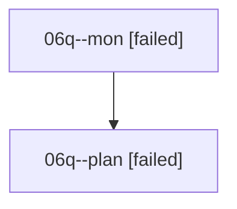

# Family: 06q

[Agent Hoods](../README.md) / [bbugyi200](../users/bbugyi200/README.md) / [athena](../users/bbugyi200/machines/athena/README.md) / [06q](../users/bbugyi200/machines/athena/hoods/06q/README.md) / 06q

Owner: `bbugyi200.athena` · Hood: `06q` · Members: 2

## Lineage

The diagram is an optional enhancement; the ordered table below contains the same lineage in accessible text.

| Role | Agent | State | Model / provider | Timing | Commits | Prompt | Chat |
|---|---|---|---|---|---:|---|---|
| mon | 06q--mon | failed | opus / claude | 2026-08-18T19:29:32.888871+00:00 | 0 | — | [Chat](../agents/bbugyi200.athena.06q--mon/chat.md) |
| plan | 06q--plan | failed | opus / claude | 2026-08-18T19:11:32.539533+00:00 | 0 | [Prompt](../agents/bbugyi200.athena.06q--plan/prompt.md) | [Chat](../agents/bbugyi200.athena.06q--plan/chat.md) |
