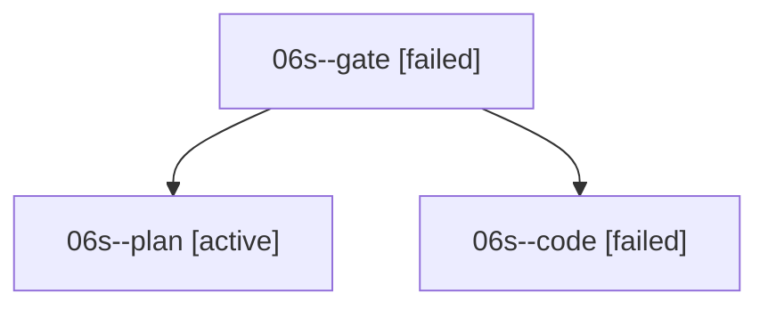

# Family: 06s

[Agent Hoods](../README.md) / [bbugyi200](../users/bbugyi200/README.md) / [athena](../users/bbugyi200/machines/athena/README.md) / [06s](../users/bbugyi200/machines/athena/hoods/06s/README.md) / 06s

Owner: `bbugyi200.athena` · Hood: `06s` · Members: 3

## Lineage

The diagram is an optional enhancement; the ordered table below contains the same lineage in accessible text.

| Role | Agent | State | Model / provider | Timing | Commits | Prompt | Chat |
|---|---|---|---|---|---:|---|---|
| gate | 06s--gate | failed | claude-fable-5 / claude | 2026-09-07T22:52:17.802407+00:00 → 2026-09-07T22:54:17.889952+00:00 | 0 | — | [Chat](../agents/bbugyi200.athena.06s--gate/chat.md) |
| plan | 06s--plan | active | claude-fable-5 / claude | 2026-09-07T22:35:22.838043+00:00 | 0 | [Prompt](../agents/bbugyi200.athena.06s--plan/prompt.md) | [Chat](../agents/bbugyi200.athena.06s--plan/chat.md) |
| code | 06s--code | failed | grok-4.6 / grok | 2026-09-07T22:54:28.463900+00:00 → 2026-09-08T00:02:11.165925+00:00 | 0 | [Prompt](../agents/bbugyi200.athena.06s--code/prompt.md) | — |

## Commits

| Role | Repo | Commit | Subject | Committed |
|---|---|---|---|---|
| — | sase | [`e7d1e8d`](https://github.com/sase-org/sase/commit/e7d1e8de9f25653c274ae5608d8c3411c949826c) | chore: Add SDD prompt and plan for plan\_agent\_pencil\_consistency | 2026-06-25 22:23:02 EDT |
| — | sase | [`c98a35e`](https://github.com/sase-org/sase/commit/c98a35e0c5135e557a0e4e28f493e7438d748ead) | fix(ace): show pencil badge on redirected Plan agent rows | 2026-06-25 22:46:22 EDT |
| — | sase | [`e962a3e`](https://github.com/sase-org/sase/commit/e962a3ea44fcb044061d7924f99db7cb59443986) | fix(workspace): reap invisible held claims and TTL-expire ignored holds | 2026-09-08 07:04:34 EDT |
