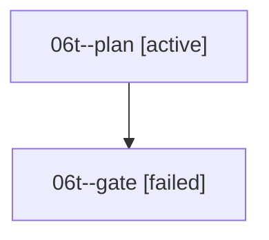

# Family: 06t

[Agent Hoods](../README.md) / [bbugyi200](../users/bbugyi200/README.md) / [athena](../users/bbugyi200/machines/athena/README.md) / [06t](../users/bbugyi200/machines/athena/hoods/06t/README.md) / 06t

Owner: `bbugyi200.athena` · Hood: `06t` · Members: 2

## Lineage

The diagram is an optional enhancement; the ordered table below contains the same lineage in accessible text.

| Role | Agent | State | Model / provider | Timing | Commits | Prompt | Chat |
|---|---|---|---|---|---:|---|---|
| plan | 06t--plan | active | claude-fable-5 / claude | 2026-09-08T11:01:38.988079+00:00 | 0 | [Prompt](../agents/bbugyi200.athena.06t--plan/prompt.md) | — |
| gate | 06t--gate | failed | claude-fable-5 / claude | 2026-09-08T11:18:19.077625+00:00 → 2026-09-08T11:18:19.504431+00:00 | 0 | — | [Chat](../agents/bbugyi200.athena.06t--gate/chat.md) |

## Commits

| Role | Repo | Commit | Subject | Committed |
|---|---|---|---|---|
| — | sase | [`235d8a6`](https://github.com/sase-org/sase/commit/235d8a6c263cd960edfefc03423335035e4cf87b) | feat(plugin): show latest version indicators | 2026-06-26 07:42:06 EDT |

## Neighbors

| Agent | Relation | State |
|---|---|---|
| [06t.w1](../agents/bbugyi200.athena.06t.w1/README.md) | descendant | completed |
