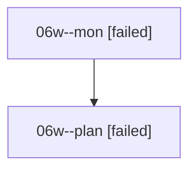

# Family: 06w

[Agent Hoods](../README.md) / [bbugyi200](../users/bbugyi200/README.md) / [athena](../users/bbugyi200/machines/athena/README.md) / [06w](../users/bbugyi200/machines/athena/hoods/06w/README.md) / 06w

Owner: `bbugyi200.athena` · Hood: `06w` · Members: 2

## Lineage

The diagram is an optional enhancement; the ordered table below contains the same lineage in accessible text.

| Role | Agent | State | Model / provider | Timing | Commits | Prompt | Chat |
|---|---|---|---|---|---:|---|---|
| mon | 06w--mon | failed | opus / claude | 2026-08-18T22:14:30.965803+00:00 | 0 | — | [Chat](../agents/bbugyi200.athena.06w--mon/chat.md) |
| plan | 06w--plan | failed | opus / claude | 2026-08-18T21:53:39.323777+00:00 | 0 | [Prompt](../agents/bbugyi200.athena.06w--plan/prompt.md) | [Chat](../agents/bbugyi200.athena.06w--plan/chat.md) |

## Commits

| Role | Repo | Commit | Subject | Committed |
|---|---|---|---|---|
| — | sase | [`b1af1bb`](https://github.com/sase-org/sase/commit/b1af1bbc39674d47b9e571555b47755b31665a23) | chore: Add SDD prompt and plan for jinja\_completion\_panel\_teardown\_guard | 2026-06-26 08:18:51 EDT |
| — | sase | [`ae1c2d1`](https://github.com/sase-org/sase/commit/ae1c2d1a64eec3d2570218ebb2b7f669f4b5a74f) | fix(tui): guard completion panel teardown | 2026-06-26 08:27:22 EDT |
