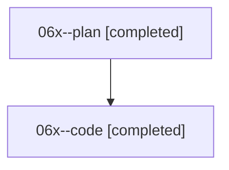

# Family: 06x

[Agent Hoods](../README.md) / [bbugyi200](../users/bbugyi200/README.md) / [athena](../users/bbugyi200/machines/athena/README.md) / [06x](../users/bbugyi200/machines/athena/hoods/06x/README.md) / 06x

Owner: `bbugyi200.athena` · Hood: `06x` · Members: 2

## Lineage

The diagram is an optional enhancement; the ordered table below contains the same lineage in accessible text.

| Role | Agent | State | Model / provider | Timing | Commits | Prompt | Chat |
|---|---|---|---|---|---:|---|---|
| plan | 06x--plan | completed | opus / claude | 2026-08-18T22:03:28.390463+00:00 | 0 | [Prompt](../agents/bbugyi200.athena.06x--plan/prompt.md) | [Chat](../agents/bbugyi200.athena.06x--plan/chat.md) |
| code | 06x--code | completed | sonnet / claude | 2026-08-18T22:19:40.152275+00:00 | [1](../agents/bbugyi200.athena.06x--code/README.md#commits) | — | [Chat](../agents/bbugyi200.athena.06x--code/chat.md) |

## Commits

| Role | Repo | Commit | Subject | Committed |
|---|---|---|---|---|
| code | sase | [`53a8994`](https://github.com/sase-org/sase/commit/53a8994225717e3e0979faeb5ec2d913eae7dcd2) | feat(tui): frame the current-project chip in a project-colored box | 2026-08-18 22:48:11 UTC |
