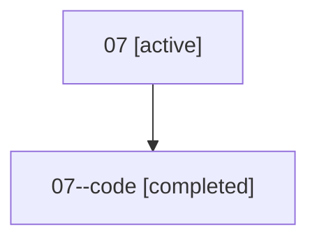

# Family: 07

[Agent Hoods](../README.md) / [bbugyi200](../users/bbugyi200/README.md) / [athena](../users/bbugyi200/machines/athena/README.md) / [07](../users/bbugyi200/machines/athena/hoods/07/README.md) / 07

Owner: `bbugyi200.athena` · Hood: `07` · Members: 2

## Lineage

The diagram is an optional enhancement; the ordered table below contains the same lineage in accessible text.

| Role | Agent | State | Model / provider | Timing | Commits | Prompt | Chat |
|---|---|---|---|---|---:|---|---|
| root | 07 | active | opus / claude | 2026-07-07T03:54:45.013292+00:00 | [1](../agents/bbugyi200.athena.07/README.md#commits) | [Prompt](../agents/bbugyi200.athena.07/prompt.md) | [Chat](../agents/bbugyi200.athena.07/chat.md) |
| code | 07--code | completed | gpt-5.5 / codex | 2026-07-07T04:04:44.691845+00:00 | [1](../agents/bbugyi200.athena.07--code/README.md#commits) | — | [Chat](../agents/bbugyi200.athena.07--code/chat.md) |

## Commits

| Role | Repo | Commit | Subject | Committed |
|---|---|---|---|---|
| — | sase | [`62cd6e6`](https://github.com/sase-org/sase/commit/62cd6e6fc7323fce87da99a28a2bfdd01f90be30) | chore: Add SDD prompt and plan for chat\_header\_bullets | 2026-06-02 16:49:31 EDT |
| — | sase | [`eb06ca9`](https://github.com/sase-org/sase/commit/eb06ca9fe4b45d0fb6a96d7ecc9c65d945f91f89) | feat: format chat metadata as bullets | 2026-06-02 16:54:53 EDT |
| root | sase | [`da5324d`](https://github.com/sase-org/sase/commit/da5324ddaa0cd525c5089436566b7f3153072749) | chore: Add SDD prompt and plan for plugins\_marked\_batch\_install | 2026-07-07 00:04:43 EDT |
| code | sase | [`cc894cb`](https://github.com/sase-org/sase/commit/cc894cb17bad89c8ed0bb3f730480996f2417888) | feat: install marked plugins in one operation | 2026-07-07 00:27:00 EDT |
