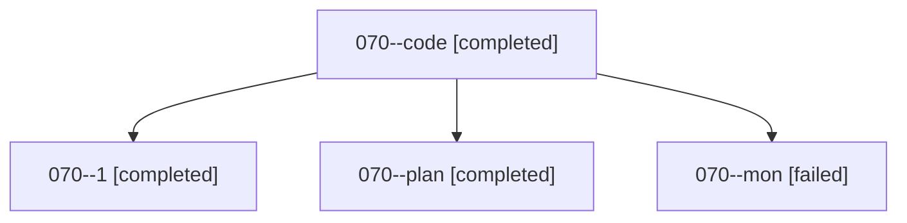

# Family: 070

[Agent Hoods](../README.md) / [bbugyi200](../users/bbugyi200/README.md) / [athena](../users/bbugyi200/machines/athena/README.md) / [070](../users/bbugyi200/machines/athena/hoods/070/README.md) / 070

Owner: `bbugyi200.athena` · Hood: `070` · Members: 4

## Lineage

The diagram is an optional enhancement; the ordered table below contains the same lineage in accessible text.

| Role | Agent | State | Model / provider | Timing | Commits | Prompt | Chat |
|---|---|---|---|---|---:|---|---|
| code | 070--code | completed | grok-4.6 / grok | 2026-08-18T22:46:29.151737+00:00 | 0 | — | [Chat](../agents/bbugyi200.athena.070--code/chat.md) |
| 1 | 070--1 | completed | grok-4.6 / grok | 2026-08-18T23:33:49.910152+00:00 | [1](../agents/bbugyi200.athena.070--1/README.md#commits) | [Prompt](../agents/bbugyi200.athena.070--1/prompt.md) | [Chat](../agents/bbugyi200.athena.070--1/chat.md) |
| plan | 070--plan | completed | opus / claude | 2026-08-18T22:36:33.293779+00:00 | 0 | [Prompt](../agents/bbugyi200.athena.070--plan/prompt.md) | [Chat](../agents/bbugyi200.athena.070--plan/chat.md) |
| mon | 070--mon | failed | grok-4.6 / grok | 2026-08-18T23:15:47.653802+00:00 | 0 | — | [Chat](../agents/bbugyi200.athena.070--mon/chat.md) |

## Commits

| Role | Repo | Commit | Subject | Committed |
|---|---|---|---|---|
| — | sase | [`773a1b5`](https://github.com/sase-org/sase/commit/773a1b598705626e3d1161734f46e6ab2bca64e5) | chore: Add SDD prompt and plan for sase\_config\_panel\_redesign | 2026-06-26 13:07:45 UTC |
| — | sase | [`df3f47d`](https://github.com/sase-org/sase/commit/df3f47dd3605645b44ba1c6cd5dc145c8e4cce4c) | feat(tui): redesign SASE Config panel | 2026-06-26 13:23:07 UTC |
| 1 | sase | [`7394b81`](https://github.com/sase-org/sase/commit/7394b8157a77cc75356d6c81eb0aa26e662b8a3b) | feat(bead): expand @path values on close, +1, and snooze | 2026-08-18 23:38:13 UTC |

## Neighbors

| Agent | Relation | State |
|---|---|---|
| [070.f1](../agents/bbugyi200.athena.070.f1/README.md) | descendant | completed |
| [070.f2](../agents/bbugyi200.athena.070.f2/README.md) | descendant | completed |
