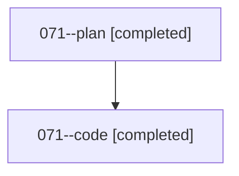

# Family: 071

[Agent Hoods](../README.md) / [bbugyi200](../users/bbugyi200/README.md) / [athena](../users/bbugyi200/machines/athena/README.md) / [071](../users/bbugyi200/machines/athena/hoods/071/README.md) / 071

Owner: `bbugyi200.athena` · Hood: `071` · Members: 2

## Lineage

The diagram is an optional enhancement; the ordered table below contains the same lineage in accessible text.

| Role | Agent | State | Model / provider | Timing | Commits | Prompt | Chat |
|---|---|---|---|---|---:|---|---|
| plan | 071--plan | completed | opus / claude | 2026-08-18T22:37:24.278708+00:00 | 0 | [Prompt](../agents/bbugyi200.athena.071--plan/prompt.md) | [Chat](../agents/bbugyi200.athena.071--plan/chat.md) |
| code | 071--code | completed | grok-4.6 / grok | 2026-08-18T22:53:49.695439+00:00 | [1](../agents/bbugyi200.athena.071--code/README.md#commits) | — | [Chat](../agents/bbugyi200.athena.071--code/chat.md) |

## Commits

| Role | Repo | Commit | Subject | Committed |
|---|---|---|---|---|
| code | sase | [`4c5c062`](https://github.com/sase-org/sase/commit/4c5c06278109d6665e3581ebc96ac6323163b77f) | fix(agent): reuse names on ,x only when the prompt declared %id | 2026-08-18 23:18:10 UTC |
