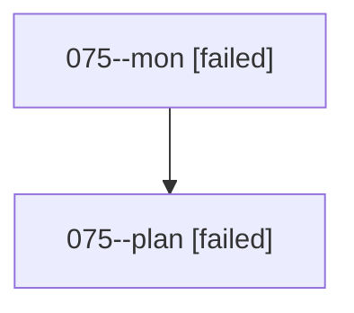

# Family: 075

[Agent Hoods](../README.md) / [bbugyi200](../users/bbugyi200/README.md) / [athena](../users/bbugyi200/machines/athena/README.md) / [075](../users/bbugyi200/machines/athena/hoods/075/README.md) / 075

Owner: `bbugyi200.athena` · Hood: `075` · Members: 2

## Lineage

The diagram is an optional enhancement; the ordered table below contains the same lineage in accessible text.

| Role | Agent | State | Model / provider | Timing | Commits | Prompt | Chat |
|---|---|---|---|---|---:|---|---|
| mon | 075--mon | failed | opus / claude | 2026-08-19T00:12:34.855438+00:00 | 0 | — | [Chat](../agents/bbugyi200.athena.075--mon/chat.md) |
| plan | 075--plan | failed | opus / claude | 2026-08-19T00:00:00.892671+00:00 | 0 | [Prompt](../agents/bbugyi200.athena.075--plan/prompt.md) | [Chat](../agents/bbugyi200.athena.075--plan/chat.md) |

## Commits

| Role | Repo | Commit | Subject | Committed |
|---|---|---|---|---|
| — | sase | [`687a46a`](https://github.com/sase-org/sase/commit/687a46a113fdeb6fc55330f84ea6b3df2fec366e) | chore: Add SDD prompt and plan for inline\_short\_term\_memory | 2026-06-26 19:48:43 UTC |
| — | sase | [`1a04500`](https://github.com/sase-org/sase/commit/1a04500e473b5bf83e13778558ed69a300297bbb) | chore: create inline memory epic beads | 2026-06-26 19:54:47 UTC |
