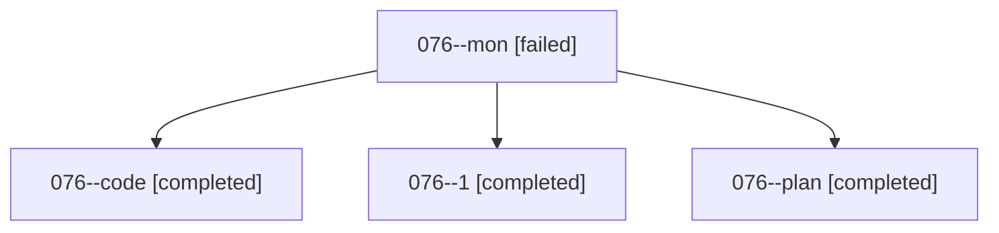

# Family: 076

[Agent Hoods](../README.md) / [bbugyi200](../users/bbugyi200/README.md) / [athena](../users/bbugyi200/machines/athena/README.md) / [076](../users/bbugyi200/machines/athena/hoods/076/README.md) / 076

Owner: `bbugyi200.athena` · Hood: `076` · Members: 4

## Lineage

The diagram is an optional enhancement; the ordered table below contains the same lineage in accessible text.

| Role | Agent | State | Model / provider | Timing | Commits | Prompt | Chat |
|---|---|---|---|---|---:|---|---|
| mon | 076--mon | failed | grok-4.6 / grok | 2026-08-19T00:27:40.808931+00:00 | 0 | — | [Chat](../agents/bbugyi200.athena.076--mon/chat.md) |
| code | 076--code | completed | grok-4.6 / grok | 2026-08-19T00:11:35.751320+00:00 | 0 | — | [Chat](../agents/bbugyi200.athena.076--code/chat.md) |
| 1 | 076--1 | completed | grok-4.6 / grok | 2026-08-19T00:30:31.527159+00:00 | [1](../agents/bbugyi200.athena.076--1/README.md#commits) | [Prompt](../agents/bbugyi200.athena.076--1/prompt.md) | [Chat](../agents/bbugyi200.athena.076--1/chat.md) |
| plan | 076--plan | completed | opus / claude | 2026-08-19T00:05:48.315618+00:00 | 0 | [Prompt](../agents/bbugyi200.athena.076--plan/prompt.md) | [Chat](../agents/bbugyi200.athena.076--plan/chat.md) |

## Commits

| Role | Repo | Commit | Subject | Committed |
|---|---|---|---|---|
| — | sase | [`8442d08`](https://github.com/sase-org/sase/commit/8442d08e8b13082505d6f7b921f9a41a1228efa6) | chore: Add SDD prompt and plan for plugin\_uninstall | 2026-06-26 15:49:03 EDT |
| — | sase | [`2834fe4`](https://github.com/sase-org/sase/commit/2834fe4158137388c8cd70b8c5258d9f3493d4a3) | feat(plugins): add \`sase plugin uninstall \<plugin\>\` | 2026-06-26 16:09:59 EDT |
| 1 | sase | [`3fb0bbb`](https://github.com/sase-org/sase/commit/3fb0bbbd62287a7033eb7a28a5d1e7f10a72bed7) | fix(tui): grey the monitor-shell gear once its monitor settles | 2026-08-18 20:31:49 EDT |
