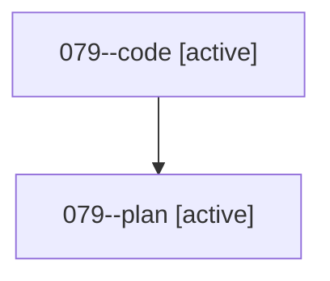

# Family: 079

[Agent Hoods](../README.md) / [bbugyi200](../users/bbugyi200/README.md) / [athena](../users/bbugyi200/machines/athena/README.md) / [079](../users/bbugyi200/machines/athena/hoods/079/README.md) / 079

Owner: `bbugyi200.athena` · Hood: `079` · Members: 2

## Lineage

The diagram is an optional enhancement; the ordered table below contains the same lineage in accessible text.

| Role | Agent | State | Model / provider | Timing | Commits | Prompt | Chat |
|---|---|---|---|---|---:|---|---|
| code | 079--code | active | grok-4.6 / grok | 2026-08-19T00:28:14.984617+00:00 | 0 | — | — |
| plan | 079--plan | active | opus / claude | 2026-08-19T00:22:10.567179+00:00 | 0 | [Prompt](../agents/bbugyi200.athena.079--plan/prompt.md) | [Chat](../agents/bbugyi200.athena.079--plan/chat.md) |

## Commits

| Role | Repo | Commit | Subject | Committed |
|---|---|---|---|---|
| — | sase | [`2156918`](https://github.com/sase-org/sase/commit/215691847a56a3bd78680855acf18064bc1a6156) | chore: Add SDD prompt and plan for swap\_a\_big\_a\_keymaps | 2026-06-26 17:07:41 EDT |
