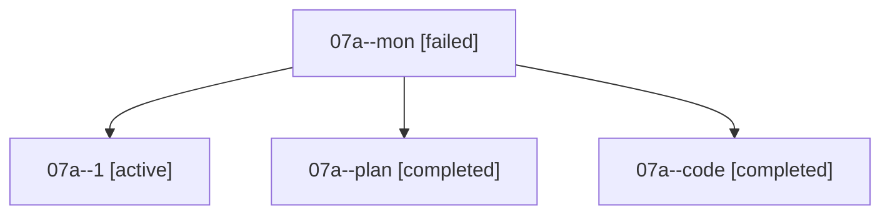

# Family: 07a

[Agent Hoods](../README.md) / [bbugyi200](../users/bbugyi200/README.md) / [athena](../users/bbugyi200/machines/athena/README.md) / [07a](../users/bbugyi200/machines/athena/hoods/07a/README.md) / 07a

Owner: `bbugyi200.athena` · Hood: `07a` · Members: 4

## Lineage

The diagram is an optional enhancement; the ordered table below contains the same lineage in accessible text.

| Role | Agent | State | Model / provider | Timing | Commits | Prompt | Chat |
|---|---|---|---|---|---:|---|---|
| mon | 07a--mon | failed | grok-4.6 / grok | 2026-08-19T01:29:10.799710+00:00 | 0 | — | [Chat](../agents/bbugyi200.athena.07a--mon/chat.md) |
| 1 | 07a--1 | active | grok-4.6 / grok | 2026-08-19T01:30:11.227514+00:00 | [1](../agents/bbugyi200.athena.07a--1/README.md#commits) | [Prompt](../agents/bbugyi200.athena.07a--1/prompt.md) | — |
| plan | 07a--plan | completed | opus / claude | 2026-08-19T00:24:48.784182+00:00 | 0 | [Prompt](../agents/bbugyi200.athena.07a--plan/prompt.md) | [Chat](../agents/bbugyi200.athena.07a--plan/chat.md) |
| code | 07a--code | completed | grok-4.6 / grok | 2026-08-19T00:41:05.850515+00:00 | 0 | — | [Chat](../agents/bbugyi200.athena.07a--code/chat.md) |

## Commits

| Role | Repo | Commit | Subject | Committed |
|---|---|---|---|---|
| — | sase | [`35834a9`](https://github.com/sase-org/sase/commit/35834a91a9b827bc9a7a9baa7560bbc67591aed6) | chore: Add SDD prompt and plan for swap\_agents\_a\_keymaps | 2026-06-26 21:19:40 UTC |
| — | sase | [`e8e17de`](https://github.com/sase-org/sase/commit/e8e17de24eea0942876645325d1c989d681f3cc7) | feat(tui)!: swap Agents-tab \`a\`/\`A\` keymap defaults | 2026-06-26 21:54:14 UTC |
| 1 | sase | [`0c341d6`](https://github.com/sase-org/sase/commit/0c341d6073a3ba95e4f2bd2b0d09b40ddfc3322e) | feat(ace): seed the Patches query with the current project | 2026-08-19 01:32:51 UTC |
