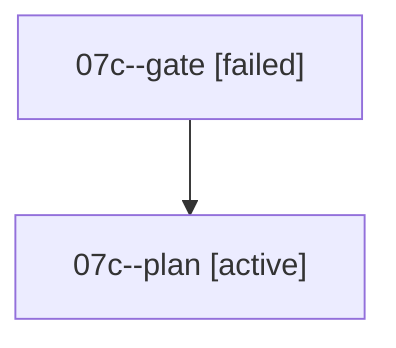

# Family: 07c

[Agent Hoods](../README.md) / [bbugyi200](../users/bbugyi200/README.md) / [athena](../users/bbugyi200/machines/athena/README.md) / [07c](../users/bbugyi200/machines/athena/hoods/07c/README.md) / 07c

Owner: `bbugyi200.athena` · Hood: `07c` · Members: 2

## Lineage

The diagram is an optional enhancement; the ordered table below contains the same lineage in accessible text.

| Role | Agent | State | Model / provider | Timing | Commits | Prompt | Chat |
|---|---|---|---|---|---:|---|---|
| gate | 07c--gate | failed | gpt-5.6-sol / codex | 2026-09-08T13:06:06.474480+00:00 → 2026-09-08T13:10:50.634781+00:00 | 0 | — | [Chat](../agents/bbugyi200.athena.07c--gate/chat.md) |
| plan | 07c--plan | active | gpt-5.6-sol / codex | 2026-09-08T12:36:56.681410+00:00 | 0 | [Prompt](../agents/bbugyi200.athena.07c--plan/prompt.md) | [Chat](../agents/bbugyi200.athena.07c--plan/chat.md) |

## Commits

| Role | Repo | Commit | Subject | Committed |
|---|---|---|---|---|
| — | sase | [`3ddfab3`](https://github.com/sase-org/sase/commit/3ddfab3438e099cc59bdd759f59a7f4f318369e2) | chore: Add SDD prompt and plan for telegram\_sequential\_questions | 2026-06-26 19:13:21 EDT |
| — | sase | [`17cb037`](https://github.com/sase-org/sase/commit/17cb037f4b361a3421868ed367b08c120444e7d6) | chore: Mark SDD plan done | 2026-06-26 20:01:12 EDT |
