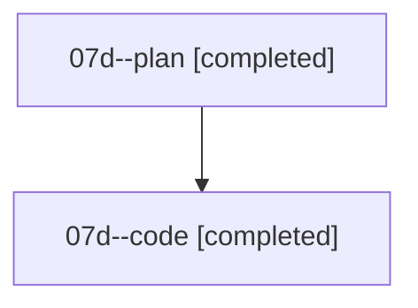

# Family: 07d

[Agent Hoods](../README.md) / [bbugyi200](../users/bbugyi200/README.md) / [athena](../users/bbugyi200/machines/athena/README.md) / [07d](../users/bbugyi200/machines/athena/hoods/07d/README.md) / 07d

Owner: `bbugyi200.athena` · Hood: `07d` · Members: 2

## Lineage

The diagram is an optional enhancement; the ordered table below contains the same lineage in accessible text.

| Role | Agent | State | Model / provider | Timing | Commits | Prompt | Chat |
|---|---|---|---|---|---:|---|---|
| plan | 07d--plan | completed | opus / claude | 2026-08-19T00:30:43.327362+00:00 | 0 | [Prompt](../agents/bbugyi200.athena.07d--plan/prompt.md) | [Chat](../agents/bbugyi200.athena.07d--plan/chat.md) |
| code | 07d--code | completed | sonnet / claude | 2026-08-19T00:40:46.983598+00:00 | [1](../agents/bbugyi200.athena.07d--code/README.md#commits) | — | [Chat](../agents/bbugyi200.athena.07d--code/chat.md) |

## Commits

| Role | Repo | Commit | Subject | Committed |
|---|---|---|---|---|
| — | sase | [`9ac9d31`](https://github.com/sase-org/sase/commit/9ac9d31c9ed0be1b26a32466c18a07fd53083832) | feat(tui): describe Admin Center tabs | 2026-06-27 11:15:46 UTC |
| code | sase | [`5091704`](https://github.com/sase-org/sase/commit/509170484e2c8b4ff2ea84595a55e769127ba552) | feat(bead): raise flake task type's triage bar to +3 | 2026-08-19 00:59:52 UTC |
