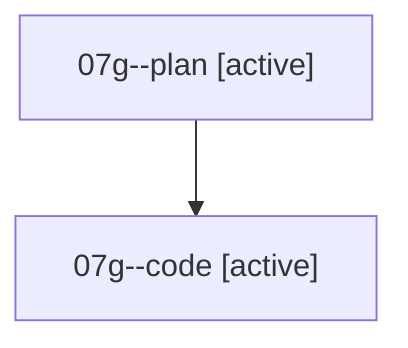

# Family: 07g

[Agent Hoods](../README.md) / [bbugyi200](../users/bbugyi200/README.md) / [athena](../users/bbugyi200/machines/athena/README.md) / [07g](../users/bbugyi200/machines/athena/hoods/07g/README.md) / 07g

Owner: `bbugyi200.athena` · Hood: `07g` · Members: 2

## Lineage

The diagram is an optional enhancement; the ordered table below contains the same lineage in accessible text.

| Role | Agent | State | Model / provider | Timing | Commits | Prompt | Chat |
|---|---|---|---|---|---:|---|---|
| plan | 07g--plan | active | opus / claude | 2026-08-19T01:08:19.195718+00:00 | 0 | [Prompt](../agents/bbugyi200.athena.07g--plan/prompt.md) | [Chat](../agents/bbugyi200.athena.07g--plan/chat.md) |
| code | 07g--code | active | grok-4.6 / grok | 2026-08-19T01:18:27.812777+00:00 | [1](../agents/bbugyi200.athena.07g--code/README.md#commits) | — | — |

## Commits

| Role | Repo | Commit | Subject | Committed |
|---|---|---|---|---|
| code | sase | [`1d66373`](https://github.com/sase-org/sase/commit/1d66373d80a8ccd0eb973087612722228c646ab9) | feat(memory): render glossary terms as one GLOSSARY TERMS paragraph | 2026-08-19 01:31:36 UTC |
