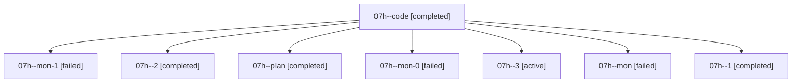

# Family: 07h

[Agent Hoods](../README.md) / [bbugyi200](../users/bbugyi200/README.md) / [athena](../users/bbugyi200/machines/athena/README.md) / [07h](../users/bbugyi200/machines/athena/hoods/07h/README.md) / 07h

Owner: `bbugyi200.athena` · Hood: `07h` · Members: 8

## Lineage

The diagram is an optional enhancement; the ordered table below contains the same lineage in accessible text.

| Role | Agent | State | Model / provider | Timing | Commits | Prompt | Chat |
|---|---|---|---|---|---:|---|---|
| code | 07h--code | completed | grok-4.6 / grok | 2026-08-19T11:46:41.823906+00:00 | 0 | — | [Chat](../agents/bbugyi200.athena.07h--code/chat.md) |
| mon-1 | 07h--mon-1 | failed | grok-4.6 / grok | 2026-08-19T12:53:59.630226+00:00 | 0 | — | [Chat](../agents/bbugyi200.athena.07h--mon-1/chat.md) |
| 2 | 07h--2 | completed | grok-4.6 / grok | 2026-08-19T12:47:48.607064+00:00 | 0 | [Prompt](../agents/bbugyi200.athena.07h--2/prompt.md) | [Chat](../agents/bbugyi200.athena.07h--2/chat.md) |
| plan | 07h--plan | completed | opus / claude | 2026-08-19T11:31:18.339829+00:00 | 0 | [Prompt](../agents/bbugyi200.athena.07h--plan/prompt.md) | [Chat](../agents/bbugyi200.athena.07h--plan/chat.md) |
| mon-0 | 07h--mon-0 | failed | grok-4.6 / grok | 2026-08-19T12:46:16.852164+00:00 | 0 | — | [Chat](../agents/bbugyi200.athena.07h--mon-0/chat.md) |
| 3 | 07h--3 | active | grok-4.6 / grok | 2026-08-19T12:55:23.196640+00:00 | 0 | [Prompt](../agents/bbugyi200.athena.07h--3/prompt.md) | — |
| mon | 07h--mon | failed | grok-4.6 / grok | 2026-08-19T12:22:06.869954+00:00 | 0 | — | [Chat](../agents/bbugyi200.athena.07h--mon/chat.md) |
| 1 | 07h--1 | completed | grok-4.6 / grok | 2026-08-19T12:38:55.694225+00:00 | 0 | [Prompt](../agents/bbugyi200.athena.07h--1/prompt.md) | [Chat](../agents/bbugyi200.athena.07h--1/chat.md) |
