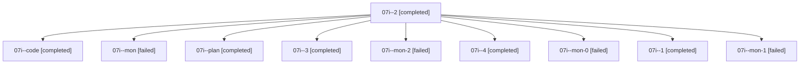

# Family: 07i

[Agent Hoods](../README.md) / [bbugyi200](../users/bbugyi200/README.md) / [athena](../users/bbugyi200/machines/athena/README.md) / [07i](../users/bbugyi200/machines/athena/hoods/07i/README.md) / 07i

Owner: `bbugyi200.athena` · Hood: `07i` · Members: 10

## Lineage

The diagram is an optional enhancement; the ordered table below contains the same lineage in accessible text.

| Role | Agent | State | Model / provider | Timing | Commits | Prompt | Chat |
|---|---|---|---|---|---:|---|---|
| 2 | 07i--2 | completed | sonnet / claude | 2026-08-19T12:50:07.372506+00:00 | 0 | [Prompt](../agents/bbugyi200.athena.07i--2/prompt.md) | [Chat](../agents/bbugyi200.athena.07i--2/chat.md) |
| code | 07i--code | completed | sonnet / claude | 2026-08-19T12:09:12.094246+00:00 | 0 | — | [Chat](../agents/bbugyi200.athena.07i--code/chat.md) |
| mon | 07i--mon | failed | sonnet / claude | 2026-08-19T12:47:57.196383+00:00 | 0 | — | [Chat](../agents/bbugyi200.athena.07i--mon/chat.md) |
| plan | 07i--plan | completed | opus / claude | 2026-08-19T11:50:24.504923+00:00 | 0 | [Prompt](../agents/bbugyi200.athena.07i--plan/prompt.md) | [Chat](../agents/bbugyi200.athena.07i--plan/chat.md) |
| 3 | 07i--3 | completed | sonnet / claude | 2026-08-19T13:03:49.355657+00:00 | 0 | [Prompt](../agents/bbugyi200.athena.07i--3/prompt.md) | [Chat](../agents/bbugyi200.athena.07i--3/chat.md) |
| mon-2 | 07i--mon-2 | failed | sonnet / claude | 2026-08-19T13:09:13.504025+00:00 | 0 | — | [Chat](../agents/bbugyi200.athena.07i--mon-2/chat.md) |
| 4 | 07i--4 | completed | sonnet / claude | 2026-08-19T13:11:45.507111+00:00 | 0 | [Prompt](../agents/bbugyi200.athena.07i--4/prompt.md) | [Chat](../agents/bbugyi200.athena.07i--4/chat.md) |
| mon-0 | 07i--mon-0 | failed | sonnet / claude | 2026-08-19T12:49:31.910810+00:00 | 0 | — | [Chat](../agents/bbugyi200.athena.07i--mon-0/chat.md) |
| 1 | 07i--1 | completed | sonnet / claude | 2026-08-19T12:48:40.258976+00:00 | 0 | [Prompt](../agents/bbugyi200.athena.07i--1/prompt.md) | [Chat](../agents/bbugyi200.athena.07i--1/chat.md) |
| mon-1 | 07i--mon-1 | failed | sonnet / claude | 2026-08-19T12:51:32.635835+00:00 | 0 | — | [Chat](../agents/bbugyi200.athena.07i--mon-1/chat.md) |

## Commits

| Role | Repo | Commit | Subject | Committed |
|---|---|---|---|---|
| — | sase | [`764ed39`](https://github.com/sase-org/sase/commit/764ed39d94b604c692bf42d4081241f324dba410) | chore: Add SDD prompt and plan for create\_prompt\_snippet\_option | 2026-06-27 08:10:25 EDT |
| — | sase | [`0311120`](https://github.com/sase-org/sase/commit/0311120d48b97deae8b0ba88a76c0607d5f02083) | feat(tui): add "Create a new snippet" option to prompt save menu | 2026-06-27 08:35:06 EDT |

## Neighbors

| Agent | Relation | State |
|---|---|---|
| [07i.f1](../agents/bbugyi200.athena.07i.f1/README.md) | descendant | completed |
