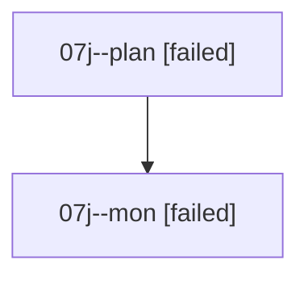

# Family: 07j

[Agent Hoods](../README.md) / [bbugyi200](../users/bbugyi200/README.md) / [athena](../users/bbugyi200/machines/athena/README.md) / [07j](../users/bbugyi200/machines/athena/hoods/07j/README.md) / 07j

Owner: `bbugyi200.athena` · Hood: `07j` · Members: 2

## Lineage

The diagram is an optional enhancement; the ordered table below contains the same lineage in accessible text.

| Role | Agent | State | Model / provider | Timing | Commits | Prompt | Chat |
|---|---|---|---|---|---:|---|---|
| plan | 07j--plan | failed | opus / claude | 2026-08-19T12:02:49.672200+00:00 | 0 | [Prompt](../agents/bbugyi200.athena.07j--plan/prompt.md) | [Chat](../agents/bbugyi200.athena.07j--plan/chat.md) |
| mon | 07j--mon | failed | opus / claude | 2026-08-19T12:16:30.901114+00:00 | 0 | — | [Chat](../agents/bbugyi200.athena.07j--mon/chat.md) |

## Commits

| Role | Repo | Commit | Subject | Committed |
|---|---|---|---|---|
| — | sase | [`ef8a638`](https://github.com/sase-org/sase/commit/ef8a638566629632170d1706f16fee4d93972dde) | chore: Add SDD prompt and plan for memory\_init\_wording | 2026-06-27 12:20:35 UTC |
| — | sase | [`25a6b0d`](https://github.com/sase-org/sase/commit/25a6b0d3835ff50993ab1ce3e41ec96bad3f281f) | chore(memory): reword short-term memory header in managed instructions | 2026-06-27 12:25:53 UTC |
