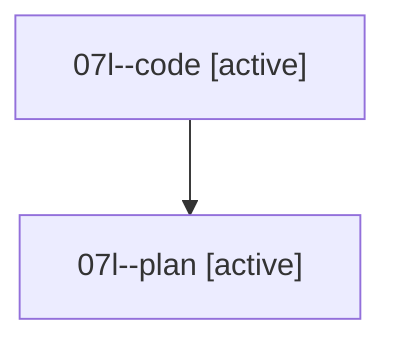

# Family: 07l

[Agent Hoods](../README.md) / [bbugyi200](../users/bbugyi200/README.md) / [athena](../users/bbugyi200/machines/athena/README.md) / [07l](../users/bbugyi200/machines/athena/hoods/07l/README.md) / 07l

Owner: `bbugyi200.athena` · Hood: `07l` · Members: 2

## Lineage

The diagram is an optional enhancement; the ordered table below contains the same lineage in accessible text.

| Role | Agent | State | Model / provider | Timing | Commits | Prompt | Chat |
|---|---|---|---|---|---:|---|---|
| code | 07l--code | active | grok-4.6 / grok | 2026-08-19T13:14:43.190198+00:00 | [1](../agents/bbugyi200.athena.07l--code/README.md#commits) | — | — |
| plan | 07l--plan | active | opus / claude | 2026-08-19T13:04:15.992999+00:00 | 0 | [Prompt](../agents/bbugyi200.athena.07l--plan/prompt.md) | [Chat](../agents/bbugyi200.athena.07l--plan/chat.md) |

## Commits

| Role | Repo | Commit | Subject | Committed |
|---|---|---|---|---|
| code | sase | [`cdf58ac`](https://github.com/sase-org/sase/commit/cdf58ac00bf2d7eb469b91ba5ed620f991c20597) | feat(ace): page glossary-read reports from GLOSSARY hints | 2026-08-19 10:13:22 EDT |
