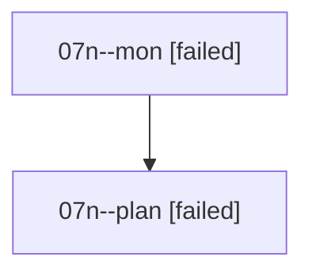

# Family: 07n

[Agent Hoods](../README.md) / [bbugyi200](../users/bbugyi200/README.md) / [athena](../users/bbugyi200/machines/athena/README.md) / [07n](../users/bbugyi200/machines/athena/hoods/07n/README.md) / 07n

Owner: `bbugyi200.athena` · Hood: `07n` · Members: 2

## Lineage

The diagram is an optional enhancement; the ordered table below contains the same lineage in accessible text.

| Role | Agent | State | Model / provider | Timing | Commits | Prompt | Chat |
|---|---|---|---|---|---:|---|---|
| mon | 07n--mon | failed | opus / claude | 2026-08-19T13:29:43.623180+00:00 | 0 | — | [Chat](../agents/bbugyi200.athena.07n--mon/chat.md) |
| plan | 07n--plan | failed | opus / claude | 2026-08-19T13:18:13.370205+00:00 | 0 | [Prompt](../agents/bbugyi200.athena.07n--plan/prompt.md) | [Chat](../agents/bbugyi200.athena.07n--plan/chat.md) |

## Commits

| Role | Repo | Commit | Subject | Committed |
|---|---|---|---|---|
| — | sase | [`87d86bd`](https://github.com/sase-org/sase/commit/87d86bd255172394570d7fd6f9e36563797116b6) | chore: Add SDD prompt and plan for commit\_tag\_prefix | 2026-06-27 08:55:46 EDT |
| — | sase | [`d671181`](https://github.com/sase-org/sase/commit/d6711811f24a03542095fa5e085416d1bfa4cfb2) | feat(commit)!: prefix SASE commit footer tags with SASE\_ | 2026-06-27 09:16:49 EDT |
