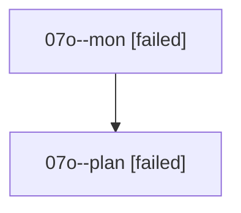

# Family: 07o

[Agent Hoods](../README.md) / [bbugyi200](../users/bbugyi200/README.md) / [athena](../users/bbugyi200/machines/athena/README.md) / [07o](../users/bbugyi200/machines/athena/hoods/07o/README.md) / 07o

Owner: `bbugyi200.athena` · Hood: `07o` · Members: 2

## Lineage

The diagram is an optional enhancement; the ordered table below contains the same lineage in accessible text.

| Role | Agent | State | Model / provider | Timing | Commits | Prompt | Chat |
|---|---|---|---|---|---:|---|---|
| mon | 07o--mon | failed | opus / claude | 2026-08-19T13:58:26.461483+00:00 | 0 | — | [Chat](../agents/bbugyi200.athena.07o--mon/chat.md) |
| plan | 07o--plan | failed | opus / claude | 2026-08-19T13:33:08.397644+00:00 | 0 | [Prompt](../agents/bbugyi200.athena.07o--plan/prompt.md) | [Chat](../agents/bbugyi200.athena.07o--plan/chat.md) |

## Commits

| Role | Repo | Commit | Subject | Committed |
|---|---|---|---|---|
| — | sase | [`b59fb31`](https://github.com/sase-org/sase/commit/b59fb311c76095e1b2aa09794d505dcbe9275ca7) | chore: Add SDD prompt and plan for confirm\_dialog\_redesign | 2026-06-27 13:01:51 UTC |
| — | sase | [`06dd1f9`](https://github.com/sase-org/sase/commit/06dd1f9ae3ee0eafa0b0b4abe2672ece3b5cf048) | fix(tui): center confirmation dialogs | 2026-06-27 13:33:37 UTC |
