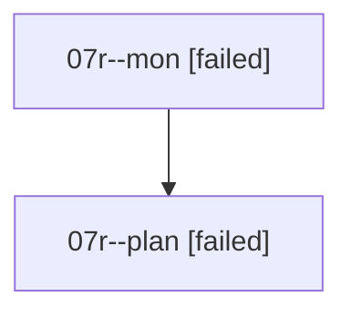

# Family: 07r

[Agent Hoods](../README.md) / [bbugyi200](../users/bbugyi200/README.md) / [athena](../users/bbugyi200/machines/athena/README.md) / [07r](../users/bbugyi200/machines/athena/hoods/07r/README.md) / 07r

Owner: `bbugyi200.athena` · Hood: `07r` · Members: 2

## Lineage

The diagram is an optional enhancement; the ordered table below contains the same lineage in accessible text.

| Role | Agent | State | Model / provider | Timing | Commits | Prompt | Chat |
|---|---|---|---|---|---:|---|---|
| mon | 07r--mon | failed | opus / claude | 2026-08-19T13:59:25.818648+00:00 | 0 | — | [Chat](../agents/bbugyi200.athena.07r--mon/chat.md) |
| plan | 07r--plan | failed | opus / claude | 2026-08-19T13:42:40.338450+00:00 | 0 | [Prompt](../agents/bbugyi200.athena.07r--plan/prompt.md) | [Chat](../agents/bbugyi200.athena.07r--plan/chat.md) |

## Commits

| Role | Repo | Commit | Subject | Committed |
|---|---|---|---|---|
| — | sase | [`1abbe07`](https://github.com/sase-org/sase/commit/1abbe07ef86e671696ad754b9e915d1af77734b8) | chore: Add SDD prompt and plan for clean\_killed\_agent\_linked\_repos | 2026-06-27 13:53:46 UTC |
