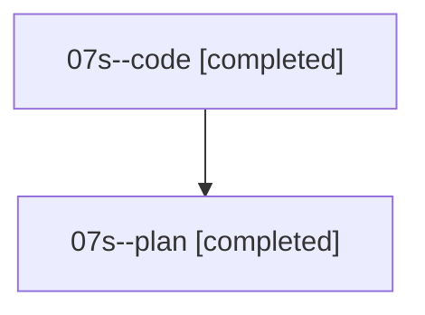

# Family: 07s

[Agent Hoods](../README.md) / [bbugyi200](../users/bbugyi200/README.md) / [athena](../users/bbugyi200/machines/athena/README.md) / [07s](../users/bbugyi200/machines/athena/hoods/07s/README.md) / 07s

Owner: `bbugyi200.athena` · Hood: `07s` · Members: 2

## Lineage

The diagram is an optional enhancement; the ordered table below contains the same lineage in accessible text.

| Role | Agent | State | Model / provider | Timing | Commits | Prompt | Chat |
|---|---|---|---|---|---:|---|---|
| code | 07s--code | completed | grok-4.6 / grok | 2026-08-19T13:59:40.195126+00:00 | 0 | — | [Chat](../agents/bbugyi200.athena.07s--code/chat.md) |
| plan | 07s--plan | completed | opus / claude | 2026-08-19T13:48:03.850354+00:00 | 0 | [Prompt](../agents/bbugyi200.athena.07s--plan/prompt.md) | [Chat](../agents/bbugyi200.athena.07s--plan/chat.md) |

## Commits

| Role | Repo | Commit | Subject | Committed |
|---|---|---|---|---|
| — | sase | [`5057a26`](https://github.com/sase-org/sase/commit/5057a264ed6df114edabc9ee04c7476555493169) | feat(glossary): add \`sase glossary all\` catalog view | 2026-08-19 10:18:57 EDT |
