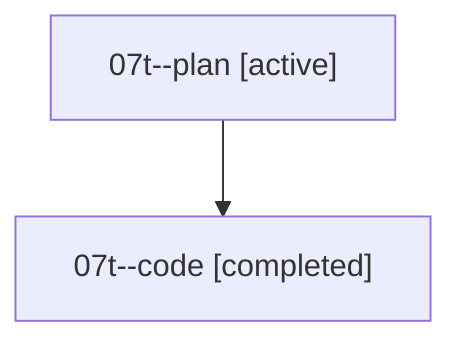

# Family: 07t

[Agent Hoods](../README.md) / [bbugyi200](../users/bbugyi200/README.md) / [athena](../users/bbugyi200/machines/athena/README.md) / [07t](../users/bbugyi200/machines/athena/hoods/07t/README.md) / 07t

Owner: `bbugyi200.athena` · Hood: `07t` · Members: 2

## Lineage

The diagram is an optional enhancement; the ordered table below contains the same lineage in accessible text.

| Role | Agent | State | Model / provider | Timing | Commits | Prompt | Chat |
|---|---|---|---|---|---:|---|---|
| plan | 07t--plan | active | opus / claude | 2026-08-19T14:07:02.066905+00:00 | 0 | [Prompt](../agents/bbugyi200.athena.07t--plan/prompt.md) | [Chat](../agents/bbugyi200.athena.07t--plan/chat.md) |
| code | 07t--code | completed | grok-4.6 / grok | 2026-08-19T14:22:32.723132+00:00 | [1](../agents/bbugyi200.athena.07t--code/README.md#commits) | — | [Chat](../agents/bbugyi200.athena.07t--code/chat.md) |

## Commits

| Role | Repo | Commit | Subject | Committed |
|---|---|---|---|---|
| — | sase | [`448f868`](https://github.com/sase-org/sase/commit/448f868357fb0eac172b98daf34b34ec022cdf64) | chore: Add SDD prompt and plan for reserved\_jinja\_globals | 2026-06-27 10:00:14 EDT |
| — | sase | [`12a6967`](https://github.com/sase-org/sase/commit/12a6967ed547252758a83c632fe7a6a4ec0fdec5) | fix(xprompt): reserve Jinja globals statically | 2026-06-27 10:08:02 EDT |
| code | sase | [`738dbb3`](https://github.com/sase-org/sase/commit/738dbb38d4a83b5ffaf0a251f9cc5c518d82949c) | fix(ace): dismiss clan family members and monitor shells in one press | 2026-08-19 11:29:32 EDT |
