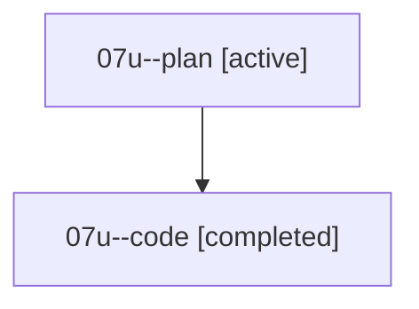

# Family: 07u

[Agent Hoods](../README.md) / [bbugyi200](../users/bbugyi200/README.md) / [athena](../users/bbugyi200/machines/athena/README.md) / [07u](../users/bbugyi200/machines/athena/hoods/07u/README.md) / 07u

Owner: `bbugyi200.athena` · Hood: `07u` · Members: 2

## Lineage

The diagram is an optional enhancement; the ordered table below contains the same lineage in accessible text.

| Role | Agent | State | Model / provider | Timing | Commits | Prompt | Chat |
|---|---|---|---|---|---:|---|---|
| plan | 07u--plan | active | opus / claude | 2026-08-19T14:17:03.693967+00:00 | 0 | [Prompt](../agents/bbugyi200.athena.07u--plan/prompt.md) | [Chat](../agents/bbugyi200.athena.07u--plan/chat.md) |
| code | 07u--code | completed | grok-4.6 / grok | 2026-08-19T15:05:25.610136+00:00 | [1](../agents/bbugyi200.athena.07u--code/README.md#commits) | — | [Chat](../agents/bbugyi200.athena.07u--code/chat.md) |

## Commits

| Role | Repo | Commit | Subject | Committed |
|---|---|---|---|---|
| code | sase | [`c624ce5`](https://github.com/sase-org/sase/commit/c624ce55fac6dab777dc5868e50680f0bc06dd0d) | fix(task-types): match use: prefixes to the original provider | 2026-08-19 11:55:21 EDT |
