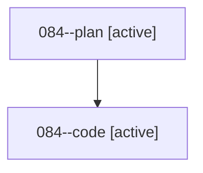

# Family: 084

[Agent Hoods](../README.md) / [bbugyi200](../users/bbugyi200/README.md) / [athena](../users/bbugyi200/machines/athena/README.md) / [084](../users/bbugyi200/machines/athena/hoods/084/README.md) / 084

Owner: `bbugyi200.athena` · Hood: `084` · Members: 2

## Lineage

The diagram is an optional enhancement; the ordered table below contains the same lineage in accessible text.

| Role | Agent | State | Model / provider | Timing | Commits | Prompt | Chat |
|---|---|---|---|---|---:|---|---|
| plan | 084--plan | active | grok-4.6 / grok | 2026-08-19T19:49:04.731114+00:00 | 0 | [Prompt](../agents/bbugyi200.athena.084--plan/prompt.md) | [Chat](../agents/bbugyi200.athena.084--plan/chat.md) |
| code | 084--code | active | grok-4.6 / grok | 2026-08-19T20:16:57.026450+00:00 | 0 | — | — |

## Commits

| Role | Repo | Commit | Subject | Committed |
|---|---|---|---|---|
| — | sase | [`e0644ef`](https://github.com/sase-org/sase/commit/e0644efad3b457e2a2196c89ef0c19f067e6bdfe) | chore: Add SDD prompt and plan for jinja\_diagnostics\_known\_vars | 2026-06-27 11:43:03 EDT |
| — | sase | [`9eb77c1`](https://github.com/sase-org/sase/commit/9eb77c1dd4683024e9dffb765989ad4dcaeba080) | fix: recognize prompt jinja runtime variables | 2026-06-27 11:50:40 EDT |
