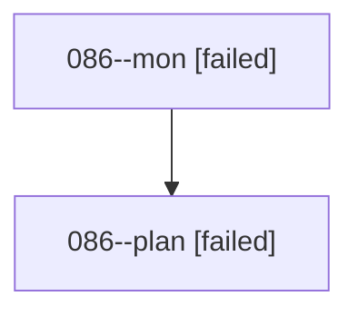

# Family: 086

[Agent Hoods](../README.md) / [bbugyi200](../users/bbugyi200/README.md) / [athena](../users/bbugyi200/machines/athena/README.md) / [086](../users/bbugyi200/machines/athena/hoods/086/README.md) / 086

Owner: `bbugyi200.athena` · Hood: `086` · Members: 2

## Lineage

The diagram is an optional enhancement; the ordered table below contains the same lineage in accessible text.

| Role | Agent | State | Model / provider | Timing | Commits | Prompt | Chat |
|---|---|---|---|---|---:|---|---|
| mon | 086--mon | failed | grok-4.6 / grok | 2026-08-19T21:09:34.217438+00:00 | 0 | — | [Chat](../agents/bbugyi200.athena.086--mon/chat.md) |
| plan | 086--plan | failed | grok-4.6 / grok | 2026-08-19T20:52:28.999076+00:00 | 0 | [Prompt](../agents/bbugyi200.athena.086--plan/prompt.md) | [Chat](../agents/bbugyi200.athena.086--plan/chat.md) |

## Commits

| Role | Repo | Commit | Subject | Committed |
|---|---|---|---|---|
| — | sase | [`84d8846`](https://github.com/sase-org/sase/commit/84d8846211566bfc00566c55266b3ae9d5b98474) | chore: Add SDD prompt and plan for ctrl\_g\_ctrl\_c\_cancel\_all | 2026-06-27 17:25:33 UTC |
| — | sase | [`f2ac8b2`](https://github.com/sase-org/sase/commit/f2ac8b20f3bb5615091372316870b70538952b70) | feat(tui): add cancel-all prompt stack chord | 2026-06-27 17:39:41 UTC |
