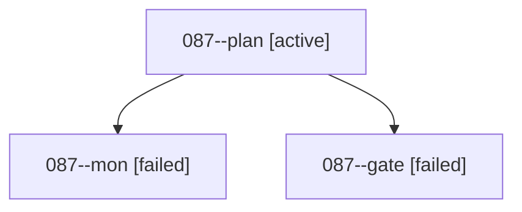

# Family: 087

[Agent Hoods](../README.md) / [bbugyi200](../users/bbugyi200/README.md) / [athena](../users/bbugyi200/machines/athena/README.md) / [087](../users/bbugyi200/machines/athena/hoods/087/README.md) / 087

Owner: `bbugyi200.athena` · Hood: `087` · Members: 3

## Lineage

The diagram is an optional enhancement; the ordered table below contains the same lineage in accessible text.

| Role | Agent | State | Model / provider | Timing | Commits | Prompt | Chat |
|---|---|---|---|---|---:|---|---|
| plan | 087--plan | active | gpt-6-astra / codex | 2026-09-08T13:16:22.298165+00:00 | 0 | [Prompt](../agents/bbugyi200.athena.087--plan/prompt.md) | [Chat](../agents/bbugyi200.athena.087--plan/chat.md) |
| mon | 087--mon | failed | gpt-6-astra / codex | 2026-09-08T13:25:46.080367+00:00 → 2026-09-08T13:29:12.422207+00:00 | 0 | — | [Chat](../agents/bbugyi200.athena.087--mon/chat.md) |
| gate | 087--gate | failed | gpt-6-astra / codex | 2026-09-08T13:24:21.516972+00:00 → 2026-09-08T13:25:51.956917+00:00 | 0 | — | [Chat](../agents/bbugyi200.athena.087--gate/chat.md) |

## Commits

| Role | Repo | Commit | Subject | Committed |
|---|---|---|---|---|
| — | sase | [`b07a7bb`](https://github.com/sase-org/sase/commit/b07a7bbfb7060a75dcbae109f2742cd0d593b40a) | chore: Add SDD prompt and plan for q\_keymap\_stop\_axe\_and\_quit | 2026-06-27 13:33:08 EDT |
| — | sase | [`83f7bf4`](https://github.com/sase-org/sase/commit/83f7bf4a8a2114000f48ccdf861f0c684e44f5ba) | fix(ace): stop axe robustly before quit | 2026-06-27 13:42:58 EDT |

## Neighbors

| Agent | Relation | State |
|---|---|---|
| [087.w1](../agents/bbugyi200.athena.087.w1/README.md) | descendant | completed |
| [087.w1.f1](../agents/bbugyi200.athena.087.w1.f1/README.md) | descendant | completed |
