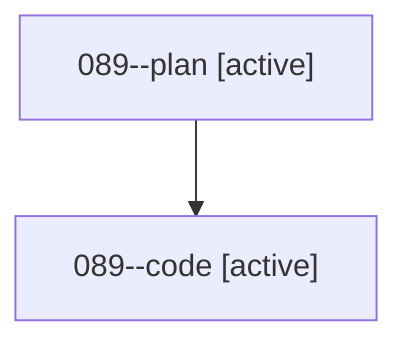

# Family: 089

[Agent Hoods](../README.md) / [bbugyi200](../users/bbugyi200/README.md) / [athena](../users/bbugyi200/machines/athena/README.md) / [089](../users/bbugyi200/machines/athena/hoods/089/README.md) / 089

Owner: `bbugyi200.athena` · Hood: `089` · Members: 2

## Lineage

The diagram is an optional enhancement; the ordered table below contains the same lineage in accessible text.

| Role | Agent | State | Model / provider | Timing | Commits | Prompt | Chat |
|---|---|---|---|---|---:|---|---|
| plan | 089--plan | active | grok-4.6 / grok | 2026-08-19T20:53:01.564673+00:00 | 0 | [Prompt](../agents/bbugyi200.athena.089--plan/prompt.md) | [Chat](../agents/bbugyi200.athena.089--plan/chat.md) |
| code | 089--code | active | grok-4.6 / grok | 2026-08-19T21:06:27.205625+00:00 | [1](../agents/bbugyi200.athena.089--code/README.md#commits) | — | — |

## Commits

| Role | Repo | Commit | Subject | Committed |
|---|---|---|---|---|
| code | sase | [`9ca7fe1`](https://github.com/sase-org/sase/commit/9ca7fe19c1d042a2cf8a6c91a545a588e4375dcf) | feat(llm): add last-resort tails for model-alias pools | 2026-08-19 18:21:28 EDT |
