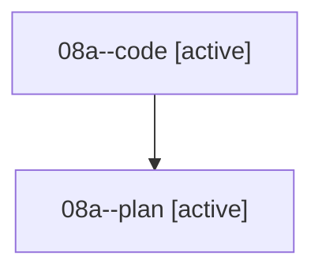

# Family: 08a

[Agent Hoods](../README.md) / [bbugyi200](../users/bbugyi200/README.md) / [athena](../users/bbugyi200/machines/athena/README.md) / [08a](../users/bbugyi200/machines/athena/hoods/08a/README.md) / 08a

Owner: `bbugyi200.athena` · Hood: `08a` · Members: 2

## Lineage

The diagram is an optional enhancement; the ordered table below contains the same lineage in accessible text.

| Role | Agent | State | Model / provider | Timing | Commits | Prompt | Chat |
|---|---|---|---|---|---:|---|---|
| code | 08a--code | active | grok-4.6 / grok | 2026-08-19T21:44:50.935690+00:00 | 0 | — | — |
| plan | 08a--plan | active | grok-4.6 / grok | 2026-08-19T21:38:57.500497+00:00 | 0 | [Prompt](../agents/bbugyi200.athena.08a--plan/prompt.md) | [Chat](../agents/bbugyi200.athena.08a--plan/chat.md) |
