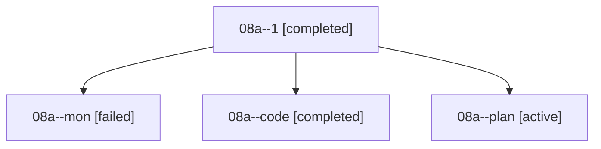

# Family: 08a

[Agent Hoods](../README.md) / [bbugyi200](../users/bbugyi200/README.md) / [athena](../users/bbugyi200/machines/athena/README.md) / [08a](../users/bbugyi200/machines/athena/hoods/08a/README.md) / 08a

Owner: `bbugyi200.athena` · Hood: `08a` · Members: 4

## Lineage

The diagram is an optional enhancement; the ordered table below contains the same lineage in accessible text.

| Role | Agent | State | Model / provider | Timing | Commits | Prompt | Chat |
|---|---|---|---|---|---:|---|---|
| 1 | 08a--1 | completed | grok-4.6 / grok | 2026-08-19T22:25:35.705428+00:00 | 0 | [Prompt](../agents/bbugyi200.athena.08a--1/prompt.md) | [Chat](../agents/bbugyi200.athena.08a--1/chat.md) |
| mon | 08a--mon | failed | grok-4.6 / grok | 2026-08-19T22:06:34.091682+00:00 | 0 | — | [Chat](../agents/bbugyi200.athena.08a--mon/chat.md) |
| code | 08a--code | completed | grok-4.6 / grok | 2026-08-19T21:44:50.935690+00:00 | 0 | — | [Chat](../agents/bbugyi200.athena.08a--code/chat.md) |
| plan | 08a--plan | active | grok-4.6 / grok | 2026-08-19T21:38:57.500497+00:00 | 0 | [Prompt](../agents/bbugyi200.athena.08a--plan/prompt.md) | [Chat](../agents/bbugyi200.athena.08a--plan/chat.md) |

## Commits

| Role | Repo | Commit | Subject | Committed |
|---|---|---|---|---|
| — | sase | [`a0d73f7`](https://github.com/sase-org/sase/commit/a0d73f7ea30d47ceb2b3fbd7010f8748780bdd5e) | fix(llm): send xhigh effort on the shipped @xlarge grok candidate | 2026-08-19 18:37:52 EDT |
