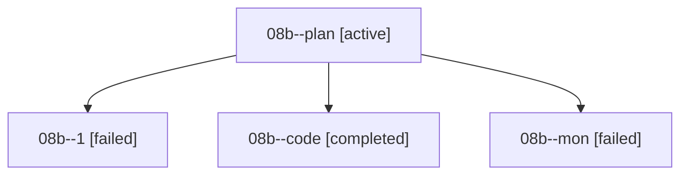

# Family: 08b

[Agent Hoods](../README.md) / [bbugyi200](../users/bbugyi200/README.md) / [athena](../users/bbugyi200/machines/athena/README.md) / [08b](../users/bbugyi200/machines/athena/hoods/08b/README.md) / 08b

Owner: `bbugyi200.athena` · Hood: `08b` · Members: 4

## Lineage

The diagram is an optional enhancement; the ordered table below contains the same lineage in accessible text.

| Role | Agent | State | Model / provider | Timing | Commits | Prompt | Chat |
|---|---|---|---|---|---:|---|---|
| plan | 08b--plan | active | grok-4.6 / grok | 2026-08-19T21:48:17.470127+00:00 | 0 | [Prompt](../agents/bbugyi200.athena.08b--plan/prompt.md) | [Chat](../agents/bbugyi200.athena.08b--plan/chat.md) |
| 1 | 08b--1 | failed | grok-4.6 / grok | 2026-08-19T22:12:39.401715+00:00 | 0 | [Prompt](../agents/bbugyi200.athena.08b--1/prompt.md) | — |
| code | 08b--code | completed | grok-4.6 / grok | 2026-08-19T22:00:29.274497+00:00 | 0 | — | [Chat](../agents/bbugyi200.athena.08b--code/chat.md) |
| mon | 08b--mon | failed | grok-4.6 / grok | 2026-08-19T22:07:06.967165+00:00 | 0 | — | [Chat](../agents/bbugyi200.athena.08b--mon/chat.md) |

## Commits

| Role | Repo | Commit | Subject | Committed |
|---|---|---|---|---|
| — | sase | [`255b707`](https://github.com/sase-org/sase/commit/255b7079c2bcbed771f0921f68044b12899fd111) | chore: Add SDD prompt and plan for auto\_approve\_pending\_plan | 2026-06-27 14:42:38 EDT |
| — | sase | [`1add4d9`](https://github.com/sase-org/sase/commit/1add4d9d8a0d4409439ed80a5b0c2521a53ecdd5) | fix: auto-approve pending plans during wait loop | 2026-06-27 14:51:20 EDT |
