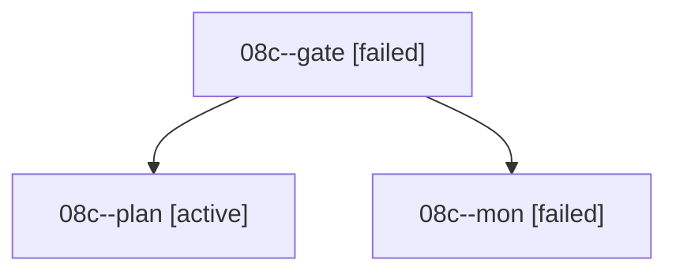

# Family: 08c

[Agent Hoods](../README.md) / [bbugyi200](../users/bbugyi200/README.md) / [athena](../users/bbugyi200/machines/athena/README.md) / [08c](../users/bbugyi200/machines/athena/hoods/08c/README.md) / 08c

Owner: `bbugyi200.athena` · Hood: `08c` · Members: 3

## Lineage

The diagram is an optional enhancement; the ordered table below contains the same lineage in accessible text.

| Role | Agent | State | Model / provider | Timing | Commits | Prompt | Chat |
|---|---|---|---|---|---:|---|---|
| gate | 08c--gate | failed | claude-fable-5 / claude | 2026-09-08T14:14:10.808797+00:00 → 2026-09-08T14:21:28.436852+00:00 | 0 | — | [Chat](../agents/bbugyi200.athena.08c--gate/chat.md) |
| plan | 08c--plan | active | claude-fable-5 / claude | 2026-09-08T13:55:35.540095+00:00 | 0 | [Prompt](../agents/bbugyi200.athena.08c--plan/prompt.md) | [Chat](../agents/bbugyi200.athena.08c--plan/chat.md) |
| mon | 08c--mon | failed | claude-fable-5 / claude | 2026-09-08T14:21:25.984737+00:00 → 2026-09-08T14:24:15.047673+00:00 | 0 | — | [Chat](../agents/bbugyi200.athena.08c--mon/chat.md) |

## Commits

| Role | Repo | Commit | Subject | Committed |
|---|---|---|---|---|
| — | sase | [`277677c`](https://github.com/sase-org/sase/commit/277677c94f668088092142826ca5b6de143d8cc2) | chore: Add SDD prompt and plan for dev\_version\_support | 2026-06-27 14:38:26 EDT |
| — | sase | [`d8ad02a`](https://github.com/sase-org/sase/commit/d8ad02a9a075fb1253dffb1ebe61c4e52df5cb6d) | chore: create dev-version support epic beads | 2026-06-27 14:49:46 EDT |
