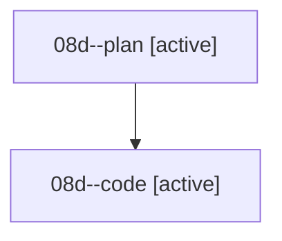

# Family: 08d

[Agent Hoods](../README.md) / [bbugyi200](../users/bbugyi200/README.md) / [athena](../users/bbugyi200/machines/athena/README.md) / [08d](../users/bbugyi200/machines/athena/hoods/08d/README.md) / 08d

Owner: `bbugyi200.athena` · Hood: `08d` · Members: 2

## Lineage

The diagram is an optional enhancement; the ordered table below contains the same lineage in accessible text.

| Role | Agent | State | Model / provider | Timing | Commits | Prompt | Chat |
|---|---|---|---|---|---:|---|---|
| plan | 08d--plan | active | grok-4.6 / grok | 2026-08-19T22:20:55.083549+00:00 | 0 | [Prompt](../agents/bbugyi200.athena.08d--plan/prompt.md) | [Chat](../agents/bbugyi200.athena.08d--plan/chat.md) |
| code | 08d--code | active | grok-4.6 / grok | 2026-08-19T22:36:03.758804+00:00 | [1](../agents/bbugyi200.athena.08d--code/README.md#commits) | — | — |

## Commits

| Role | Repo | Commit | Subject | Committed |
|---|---|---|---|---|
| code | sase | [`e85e1a7`](https://github.com/sase-org/sase/commit/e85e1a7bcacda333a5d78f62e5639880902fd717) | feat(ace): hide left-side titles on sase agent and proc shells | 2026-08-19 19:20:57 EDT |
