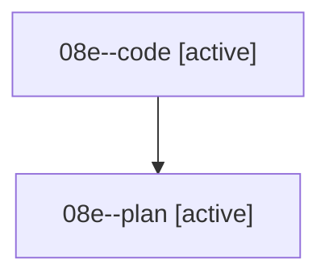

# Family: 08e

[Agent Hoods](../README.md) / [bbugyi200](../users/bbugyi200/README.md) / [athena](../users/bbugyi200/machines/athena/README.md) / [08e](../users/bbugyi200/machines/athena/hoods/08e/README.md) / 08e

Owner: `bbugyi200.athena` · Hood: `08e` · Members: 2

## Lineage

The diagram is an optional enhancement; the ordered table below contains the same lineage in accessible text.

| Role | Agent | State | Model / provider | Timing | Commits | Prompt | Chat |
|---|---|---|---|---|---:|---|---|
| code | 08e--code | active | grok-4.6 / grok | 2026-08-19T22:51:20.927611+00:00 | 0 | — | — |
| plan | 08e--plan | active | grok-4.6 / grok | 2026-08-19T22:44:17.675863+00:00 | 0 | [Prompt](../agents/bbugyi200.athena.08e--plan/prompt.md) | [Chat](../agents/bbugyi200.athena.08e--plan/chat.md) |

## Commits

| Role | Repo | Commit | Subject | Committed |
|---|---|---|---|---|
| — | sase | [`d57dfe1`](https://github.com/sase-org/sase/commit/d57dfe1d8b93feaace4da60fec42b57830b329b5) | chore: Add SDD prompt and plan for multi\_agent\_prompt\_chat\_bullet | 2026-06-27 20:01:39 UTC |
| — | sase | [`5550be6`](https://github.com/sase-org/sase/commit/5550be6015252ef589e1ebc3a15293445b5f07ff) | feat: record source prompt for multi-agent transcripts | 2026-06-27 20:14:33 UTC |
