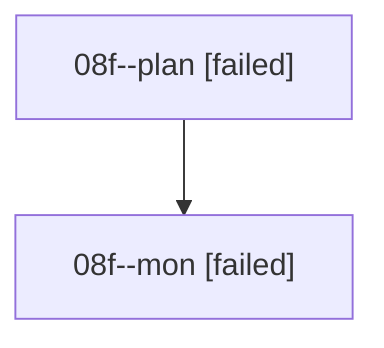

# Family: 08f

[Agent Hoods](../README.md) / [bbugyi200](../users/bbugyi200/README.md) / [athena](../users/bbugyi200/machines/athena/README.md) / [08f](../users/bbugyi200/machines/athena/hoods/08f/README.md) / 08f

Owner: `bbugyi200.athena` · Hood: `08f` · Members: 2

## Lineage

The diagram is an optional enhancement; the ordered table below contains the same lineage in accessible text.

| Role | Agent | State | Model / provider | Timing | Commits | Prompt | Chat |
|---|---|---|---|---|---:|---|---|
| plan | 08f--plan | failed | grok-4.6 / grok | 2026-08-19T22:58:52.893269+00:00 | 0 | [Prompt](../agents/bbugyi200.athena.08f--plan/prompt.md) | [Chat](../agents/bbugyi200.athena.08f--plan/chat.md) |
| mon | 08f--mon | failed | grok-4.6 / grok | 2026-08-19T23:16:30.814035+00:00 | 0 | — | [Chat](../agents/bbugyi200.athena.08f--mon/chat.md) |

## Commits

| Role | Repo | Commit | Subject | Committed |
|---|---|---|---|---|
| — | sase | [`c5060e2`](https://github.com/sase-org/sase/commit/c5060e2e0377c3ff2ba442cc6a912cb02b4d3aab) | chore: Add SDD prompt and plan for epic\_approved\_status\_reconstruction | 2026-06-27 20:04:03 UTC |
| — | sase | [`073c330`](https://github.com/sase-org/sase/commit/073c330f510416fc704af5c8eb0c8e347343acb9) | fix: reconstruct approved follow-up statuses | 2026-06-27 20:14:12 UTC |
