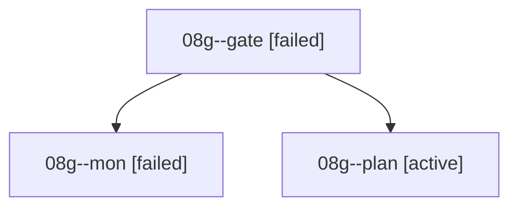

# Family: 08g

[Agent Hoods](../README.md) / [bbugyi200](../users/bbugyi200/README.md) / [athena](../users/bbugyi200/machines/athena/README.md) / [08g](../users/bbugyi200/machines/athena/hoods/08g/README.md) / 08g

Owner: `bbugyi200.athena` · Hood: `08g` · Members: 3

## Lineage

The diagram is an optional enhancement; the ordered table below contains the same lineage in accessible text.

| Role | Agent | State | Model / provider | Timing | Commits | Prompt | Chat |
|---|---|---|---|---|---:|---|---|
| gate | 08g--gate | failed | gpt-6-astra / codex | 2026-09-08T16:20:58.527678+00:00 → 2026-09-08T16:24:31.093135+00:00 | 0 | — | [Chat](../agents/bbugyi200.athena.08g--gate/chat.md) |
| mon | 08g--mon | failed | gpt-6-astra / codex | 2026-09-08T16:24:26.239993+00:00 → 2026-09-08T16:29:37.529252+00:00 | 0 | — | [Chat](../agents/bbugyi200.athena.08g--mon/chat.md) |
| plan | 08g--plan | active | gpt-6-astra / codex | 2026-09-08T16:07:10.404354+00:00 | 0 | [Prompt](../agents/bbugyi200.athena.08g--plan/prompt.md) | [Chat](../agents/bbugyi200.athena.08g--plan/chat.md) |

## Commits

| Role | Repo | Commit | Subject | Committed |
|---|---|---|---|---|
| — | sase | [`e4109b5`](https://github.com/sase-org/sase/commit/e4109b5aacb4e6ec5a7618bfa06b457b9abe4524) | chore: Add SDD prompt and plan for stuck\_starting\_agents\_orphaned\_claims | 2026-06-27 16:03:38 EDT |
| — | sase | [`39f362c`](https://github.com/sase-org/sase/commit/39f362ccc38df7e0e29d90af2cc1ac7a9aebd01d) | fix: clean up stale starting agent claims | 2026-06-27 16:30:25 EDT |
