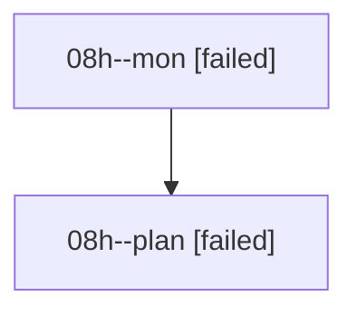

# Family: 08h

[Agent Hoods](../README.md) / [bbugyi200](../users/bbugyi200/README.md) / [athena](../users/bbugyi200/machines/athena/README.md) / [08h](../users/bbugyi200/machines/athena/hoods/08h/README.md) / 08h

Owner: `bbugyi200.athena` · Hood: `08h` · Members: 2

## Lineage

The diagram is an optional enhancement; the ordered table below contains the same lineage in accessible text.

| Role | Agent | State | Model / provider | Timing | Commits | Prompt | Chat |
|---|---|---|---|---|---:|---|---|
| mon | 08h--mon | failed | gpt-5.6-sol / codex | 2026-08-20T11:38:30.248260+00:00 | 0 | — | [Chat](../agents/bbugyi200.athena.08h--mon/chat.md) |
| plan | 08h--plan | failed | gpt-5.6-sol / codex | 2026-08-20T11:29:55.089928+00:00 | 0 | [Prompt](../agents/bbugyi200.athena.08h--plan/prompt.md) | [Chat](../agents/bbugyi200.athena.08h--plan/chat.md) |

## Commits

| Role | Repo | Commit | Subject | Committed |
|---|---|---|---|---|
| — | sase | [`f6fa3fb`](https://github.com/sase-org/sase/commit/f6fa3fbc6384078e1ade4257dfc711af18b9373b) | feat(config): pretty render structured config values | 2026-06-27 16:41:30 EDT |
