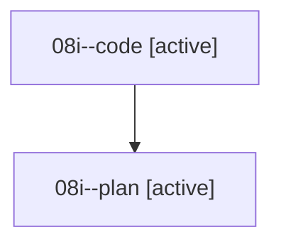

# Family: 08i

[Agent Hoods](../README.md) / [bbugyi200](../users/bbugyi200/README.md) / [athena](../users/bbugyi200/machines/athena/README.md) / [08i](../users/bbugyi200/machines/athena/hoods/08i/README.md) / 08i

Owner: `bbugyi200.athena` · Hood: `08i` · Members: 2

## Lineage

The diagram is an optional enhancement; the ordered table below contains the same lineage in accessible text.

| Role | Agent | State | Model / provider | Timing | Commits | Prompt | Chat |
|---|---|---|---|---|---:|---|---|
| code | 08i--code | active | grok-4.6 / grok | 2026-08-20T11:40:58.962702+00:00 | [1](../agents/bbugyi200.athena.08i--code/README.md#commits) | — | — |
| plan | 08i--plan | active | gpt-5.6-sol / codex | 2026-08-20T11:37:00.311967+00:00 | 0 | [Prompt](../agents/bbugyi200.athena.08i--plan/prompt.md) | [Chat](../agents/bbugyi200.athena.08i--plan/chat.md) |

## Commits

| Role | Repo | Commit | Subject | Committed |
|---|---|---|---|---|
| — | sase | [`eecfe36`](https://github.com/sase-org/sase/commit/eecfe36c594f9096e6a0e01da831a05cb118b24a) | chore: Add SDD prompt and plan for memory\_init\_header\_basename | 2026-06-27 20:24:07 UTC |
| — | sase | [`57b6a4e`](https://github.com/sase-org/sase/commit/57b6a4ed2c31f83ced4e44dc4336c69977cde0f6) | feat(memory): shorten inlined memory headers | 2026-06-27 20:36:00 UTC |
| code | sase | [`007cec1`](https://github.com/sase-org/sase/commit/007cec13cb47dd4a04b77cba2e32f018edf6ccb1) | fix(ace): step alias history by 10 runs, not ace.page\_size | 2026-08-20 12:12:06 UTC |
