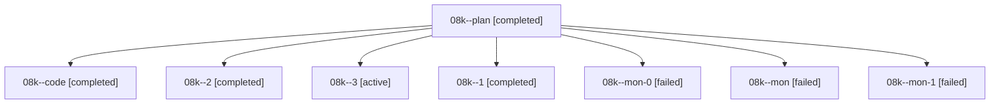

# Family: 08k

[Agent Hoods](../README.md) / [bbugyi200](../users/bbugyi200/README.md) / [athena](../users/bbugyi200/machines/athena/README.md) / [08k](../users/bbugyi200/machines/athena/hoods/08k/README.md) / 08k

Owner: `bbugyi200.athena` · Hood: `08k` · Members: 8

## Lineage

The diagram is an optional enhancement; the ordered table below contains the same lineage in accessible text.

| Role | Agent | State | Model / provider | Timing | Commits | Prompt | Chat |
|---|---|---|---|---|---:|---|---|
| plan | 08k--plan | completed | gpt-5.6-sol / codex | 2026-08-20T14:39:57.989564+00:00 | 0 | [Prompt](../agents/bbugyi200.athena.08k--plan/prompt.md) | [Chat](../agents/bbugyi200.athena.08k--plan/chat.md) |
| code | 08k--code | completed | grok-4.6 / grok | 2026-08-20T14:48:47.305162+00:00 | 0 | — | [Chat](../agents/bbugyi200.athena.08k--code/chat.md) |
| 2 | 08k--2 | completed | grok-4.6 / grok | 2026-08-20T15:53:37.623536+00:00 | 0 | [Prompt](../agents/bbugyi200.athena.08k--2/prompt.md) | [Chat](../agents/bbugyi200.athena.08k--2/chat.md) |
| 3 | 08k--3 | active | grok-4.6 / grok | 2026-08-20T16:18:10.235807+00:00 | [1](../agents/bbugyi200.athena.08k--3/README.md#commits) | [Prompt](../agents/bbugyi200.athena.08k--3/prompt.md) | — |
| 1 | 08k--1 | completed | grok-4.6 / grok | 2026-08-20T15:32:53.938823+00:00 | 0 | [Prompt](../agents/bbugyi200.athena.08k--1/prompt.md) | [Chat](../agents/bbugyi200.athena.08k--1/chat.md) |
| mon-0 | 08k--mon-0 | failed | grok-4.6 / grok | 2026-08-20T15:35:31.551821+00:00 | 0 | — | [Chat](../agents/bbugyi200.athena.08k--mon-0/chat.md) |
| mon | 08k--mon | failed | grok-4.6 / grok | 2026-08-20T15:31:33.813734+00:00 | 0 | — | [Chat](../agents/bbugyi200.athena.08k--mon/chat.md) |
| mon-1 | 08k--mon-1 | failed | grok-4.6 / grok | 2026-08-20T16:00:44.364404+00:00 | 0 | — | [Chat](../agents/bbugyi200.athena.08k--mon-1/chat.md) |

## Commits

| Role | Repo | Commit | Subject | Committed |
|---|---|---|---|---|
| 3 | sase | [`e455e87`](https://github.com/sase-org/sase/commit/e455e8723885999541d3351304e8f6f372c5e49a) | feat(ace): highlight glossary terms and repos in agent prompts | 2026-08-20 16:23:51 UTC |
