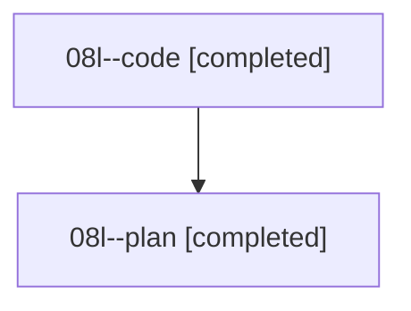

# Family: 08l

[Agent Hoods](../README.md) / [bbugyi200](../users/bbugyi200/README.md) / [athena](../users/bbugyi200/machines/athena/README.md) / [08l](../users/bbugyi200/machines/athena/hoods/08l/README.md) / 08l

Owner: `bbugyi200.athena` · Hood: `08l` · Members: 2

## Lineage

The diagram is an optional enhancement; the ordered table below contains the same lineage in accessible text.

| Role | Agent | State | Model / provider | Timing | Commits | Prompt | Chat |
|---|---|---|---|---|---:|---|---|
| code | 08l--code | completed | gpt-5.5 / codex | 2026-08-20T14:57:21.225580+00:00 | [1](../agents/bbugyi200.athena.08l--code/README.md#commits) | — | [Chat](../agents/bbugyi200.athena.08l--code/chat.md) |
| plan | 08l--plan | completed | gpt-5.6-sol / codex | 2026-08-20T14:46:22.807663+00:00 | 0 | [Prompt](../agents/bbugyi200.athena.08l--plan/prompt.md) | [Chat](../agents/bbugyi200.athena.08l--plan/chat.md) |

## Commits

| Role | Repo | Commit | Subject | Committed |
|---|---|---|---|---|
| code | sase | [`78670bc`](https://github.com/sase-org/sase/commit/78670bc6dd4cf739ac78445ff88712421340ea63) | feat(ace): show wait dependency status counts | 2026-08-20 15:42:59 UTC |
