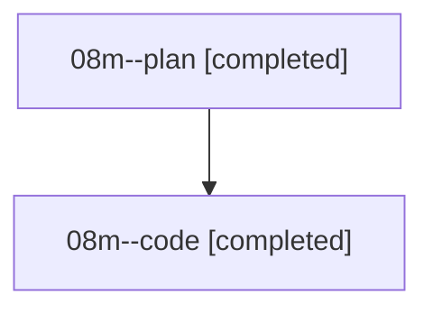

# Family: 08m

[Agent Hoods](../README.md) / [bbugyi200](../users/bbugyi200/README.md) / [athena](../users/bbugyi200/machines/athena/README.md) / [08m](../users/bbugyi200/machines/athena/hoods/08m/README.md) / 08m

Owner: `bbugyi200.athena` · Hood: `08m` · Members: 2

## Lineage

The diagram is an optional enhancement; the ordered table below contains the same lineage in accessible text.

| Role | Agent | State | Model / provider | Timing | Commits | Prompt | Chat |
|---|---|---|---|---|---:|---|---|
| plan | 08m--plan | completed | gpt-5.6-sol / codex | 2026-08-20T15:43:37.770266+00:00 | 0 | [Prompt](../agents/bbugyi200.athena.08m--plan/prompt.md) | [Chat](../agents/bbugyi200.athena.08m--plan/chat.md) |
| code | 08m--code | completed | grok-4.6 / grok | 2026-08-20T15:58:51.025632+00:00 | [1](../agents/bbugyi200.athena.08m--code/README.md#commits) | — | [Chat](../agents/bbugyi200.athena.08m--code/chat.md) |

## Commits

| Role | Repo | Commit | Subject | Committed |
|---|---|---|---|---|
| code | sase | [`21e5675`](https://github.com/sase-org/sase/commit/21e5675905ad153469be948e5e7876630762c36f) | feat(ace): show audited artifact reads in agent metadata | 2026-08-20 12:33:00 EDT |
