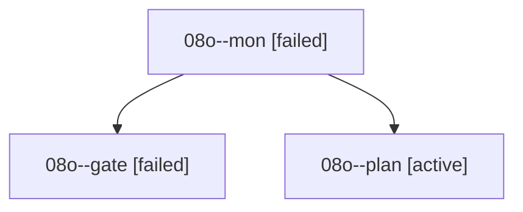

# Family: 08o

[Agent Hoods](../README.md) / [bbugyi200](../users/bbugyi200/README.md) / [athena](../users/bbugyi200/machines/athena/README.md) / [08o](../users/bbugyi200/machines/athena/hoods/08o/README.md) / 08o

Owner: `bbugyi200.athena` · Hood: `08o` · Members: 3

## Lineage

The diagram is an optional enhancement; the ordered table below contains the same lineage in accessible text.

| Role | Agent | State | Model / provider | Timing | Commits | Prompt | Chat |
|---|---|---|---|---|---:|---|---|
| mon | 08o--mon | failed | claude-fable-5 / claude | 2026-09-08T16:36:39.560639+00:00 → 2026-09-08T16:40:18.793114+00:00 | 0 | — | [Chat](../agents/bbugyi200.athena.08o--mon/chat.md) |
| gate | 08o--gate | failed | claude-fable-5 / claude | 2026-09-08T16:33:20.624870+00:00 → 2026-09-08T16:36:41.728061+00:00 | 0 | — | [Chat](../agents/bbugyi200.athena.08o--gate/chat.md) |
| plan | 08o--plan | active | claude-fable-5 / claude | 2026-09-08T16:17:01.872448+00:00 | 0 | [Prompt](../agents/bbugyi200.athena.08o--plan/prompt.md) | [Chat](../agents/bbugyi200.athena.08o--plan/chat.md) |

## Commits

| Role | Repo | Commit | Subject | Committed |
|---|---|---|---|---|
| — | sase | [`75deba2`](https://github.com/sase-org/sase/commit/75deba204262c26b7040898595f07a4262edf8cc) | feat(tui): add config detail scroll keys | 2026-06-28 08:19:17 EDT |
