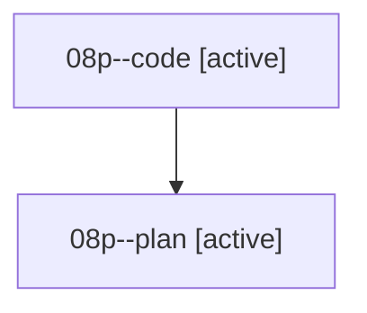

# Family: 08p

[Agent Hoods](../README.md) / [bbugyi200](../users/bbugyi200/README.md) / [athena](../users/bbugyi200/machines/athena/README.md) / [08p](../users/bbugyi200/machines/athena/hoods/08p/README.md) / 08p

Owner: `bbugyi200.athena` · Hood: `08p` · Members: 2

## Lineage

The diagram is an optional enhancement; the ordered table below contains the same lineage in accessible text.

| Role | Agent | State | Model / provider | Timing | Commits | Prompt | Chat |
|---|---|---|---|---|---:|---|---|
| code | 08p--code | active | grok-4.6 / grok | 2026-08-20T17:32:08.168792+00:00 | [1](../agents/bbugyi200.athena.08p--code/README.md#commits) | — | — |
| plan | 08p--plan | active | gpt-5.6-sol / codex | 2026-08-20T17:22:54.000893+00:00 | 0 | [Prompt](../agents/bbugyi200.athena.08p--plan/prompt.md) | [Chat](../agents/bbugyi200.athena.08p--plan/chat.md) |

## Commits

| Role | Repo | Commit | Subject | Committed |
|---|---|---|---|---|
| — | sase | [`cd84ab5`](https://github.com/sase-org/sase/commit/cd84ab5aade0bc7788ac5dc2573bfc43d24bb1d8) | feat(tui): colorize confirm dialog content | 2026-06-28 12:22:31 UTC |
| code | sase | [`0ec8609`](https://github.com/sase-org/sase/commit/0ec8609ce69b3c45e9da729afb1826762e190f71) | feat(ace): restore prompt-stash pane and cursor position | 2026-08-20 18:31:45 UTC |
