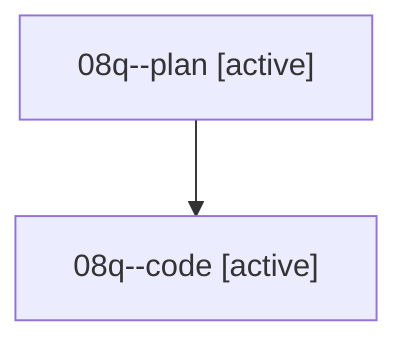

# Family: 08q

[Agent Hoods](../README.md) / [bbugyi200](../users/bbugyi200/README.md) / [athena](../users/bbugyi200/machines/athena/README.md) / [08q](../users/bbugyi200/machines/athena/hoods/08q/README.md) / 08q

Owner: `bbugyi200.athena` · Hood: `08q` · Members: 2

## Lineage

The diagram is an optional enhancement; the ordered table below contains the same lineage in accessible text.

| Role | Agent | State | Model / provider | Timing | Commits | Prompt | Chat |
|---|---|---|---|---|---:|---|---|
| plan | 08q--plan | active | gpt-5.6-sol / codex | 2026-08-20T17:24:13.282398+00:00 | 0 | [Prompt](../agents/bbugyi200.athena.08q--plan/prompt.md) | [Chat](../agents/bbugyi200.athena.08q--plan/chat.md) |
| code | 08q--code | active | grok-4.6 / grok | 2026-08-20T17:29:54.425848+00:00 | 0 | — | — |

## Commits

| Role | Repo | Commit | Subject | Committed |
|---|---|---|---|---|
| — | sase | [`50f9a16`](https://github.com/sase-org/sase/commit/50f9a1624fdf85c55c9c6ee68fbbd443a6999448) | fix(axe): prefer recorded daemon lock holder | 2026-06-28 08:19:27 EDT |
