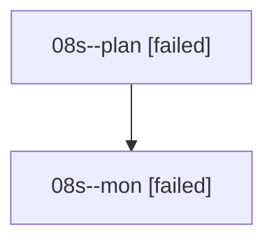

# Family: 08s

[Agent Hoods](../README.md) / [bbugyi200](../users/bbugyi200/README.md) / [athena](../users/bbugyi200/machines/athena/README.md) / [08s](../users/bbugyi200/machines/athena/hoods/08s/README.md) / 08s

Owner: `bbugyi200.athena` · Hood: `08s` · Members: 2

## Lineage

The diagram is an optional enhancement; the ordered table below contains the same lineage in accessible text.

| Role | Agent | State | Model / provider | Timing | Commits | Prompt | Chat |
|---|---|---|---|---|---:|---|---|
| plan | 08s--plan | failed | gpt-5.6-sol / codex | 2026-08-20T17:32:10.662642+00:00 | 0 | [Prompt](../agents/bbugyi200.athena.08s--plan/prompt.md) | [Chat](../agents/bbugyi200.athena.08s--plan/chat.md) |
| mon | 08s--mon | failed | gpt-5.6-sol / codex | 2026-08-20T17:44:14.402775+00:00 | 0 | — | [Chat](../agents/bbugyi200.athena.08s--mon/chat.md) |

## Commits

| Role | Repo | Commit | Subject | Committed |
|---|---|---|---|---|
| — | sase | [`ed5686f`](https://github.com/sase-org/sase/commit/ed5686f6d4d3da95aa241ffa0bb82211d98afeac) | feat(tui): add config detail scroll shortcuts | 2026-06-28 12:28:35 UTC |
